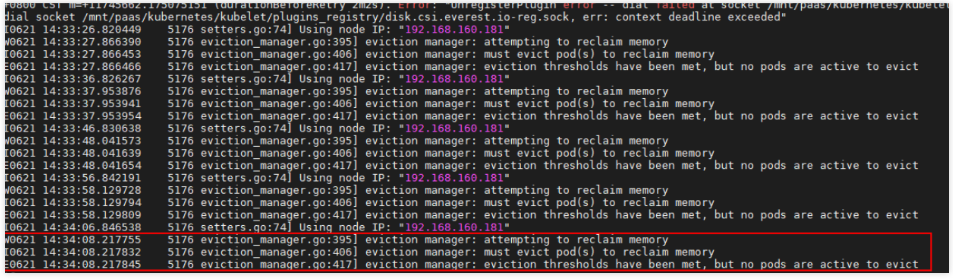
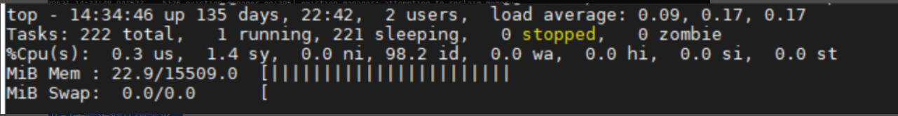

---
kind:
  - Troubleshooting
products:
  - Alauda Container Platform
  - Alauda DevOps
  - Alauda AI
  - Alauda Application Services
  - Alauda Service Mesh
  - Alauda Developer Portal
ProductsVersion:
  - 4.1.0,4.2.x
---
<!-- A type of document that involves encountering a fault, diagnosing it, performing root cause analysis, and providing solutions. -->

# 欧拉

kubelet一直在驱逐pod，把容器全终止之后还是认为内存不足 /sys/fs/cgroup/memory目录下cgroup的memory.usage_in_bytes统计值异常，与实际资源使用情况不符

## Cause
- ARM架构节点的EulerOS 2.8和EulerOS 2.9操作系统内核存在Bug

## Resolution
- 升级EulerOS 2.8到内核版本kernel-4.19.36-vhulk1907.1.0.h1088.eulerosv2r8.aarch64
- 升级EulerOS 2.9到内核版本kernel-4.19.90-vhulk2103.1.0.h539.eulerosv2r9.aarch64
- 集群版本为1.19.16-r0、1.21.7-r0、1.23.5-r0、1.25.1-r0及以上时重置节点为最新版本操作系统
- 不满足版本要求的集群需先升级到指定版本再重置节点

## [workaround]

## [Related Information]
**Screenshots**

- Environment: ARM架构的EulerOS 2.8或EulerOS 2.9操作系统
- /sys/fs/cgroup/memory/memory.usage_in_bytes
- kubelet
- cgroup
- kernel-4.19.36-vhulk1907.1.0.h1088.eulerosv2r8.aarch64
- kernel-4.19.90-vhulk2103.1.0.h539.eulerosv2r9.aarch64
- Component: Kubelet
- Page ID: 178228463
- Original Title: 欧拉-cgroup统计资源异常导致kubelet驱逐Pod
