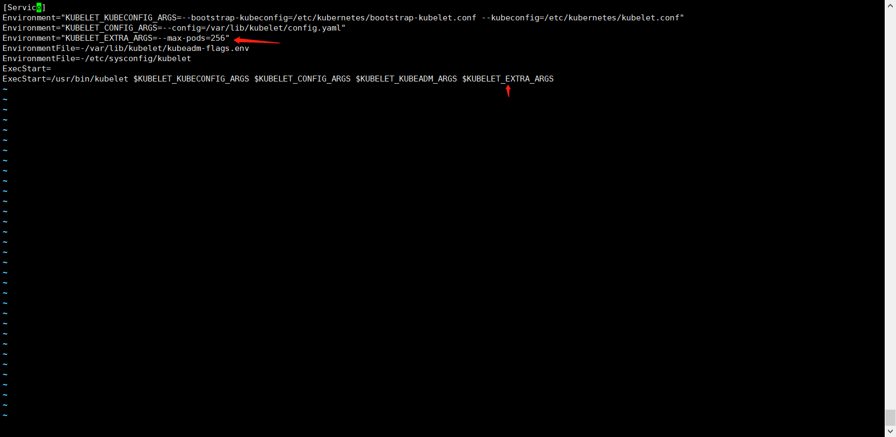

---
kind:
  - Troubleshooting
products:
  - Alauda Container Platform
  - Alauda DevOps
  - Alauda AI
  - Alauda Application Services
  - Alauda Service Mesh
  - Alauda Developer Portal
ProductsVersion:
  - 4.1.0,4.2.x
---
<!-- A type of document that involves encountering a fault, diagnosing it, performing root cause analysis, and providing solutions. -->

# ACP3.12 修改节点最大pod数

节点最大pod数达到默认限制（110）

## Cause
- 节点kubelet配置中max-pods参数为默认值110

## Resolution
- 修改/var/lib/kubelet/config.yaml添加maxPods字段并重启kubelet
- 修改/var/lib/kubelet/kubeadm-flags.env添加--max-pods参数并重启kubelet
- 修改/usr/lib/systemd/system/kubelet.service.d/10-kubeadm.conf添加环境变量参数并重启kubelet

## [workaround]

## [Related Information]
**Screenshots**

- Environment: 通用
- /var/lib/kubelet/config.yaml
- /usr/lib/systemd/system/kubelet.service.d/10-kubeadm.conf
- /var/lib/kubelet/kubeadm-flags.env
- kubelet.service
- maxPods
- --max-pods
- Component: Kubelet
- Page ID: 182454434
- Original Title: ACP3.12 修改节点最大pod数
