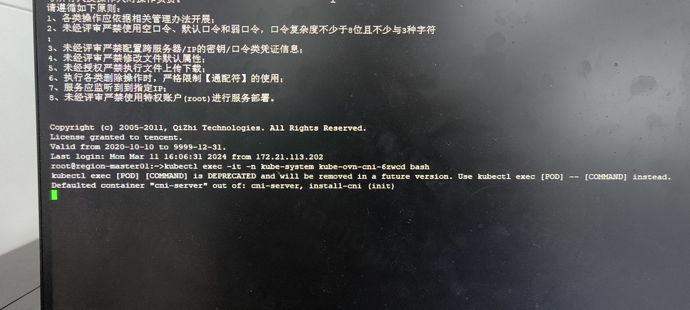
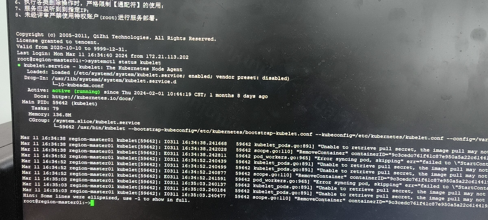
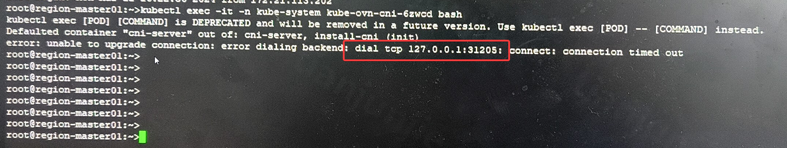
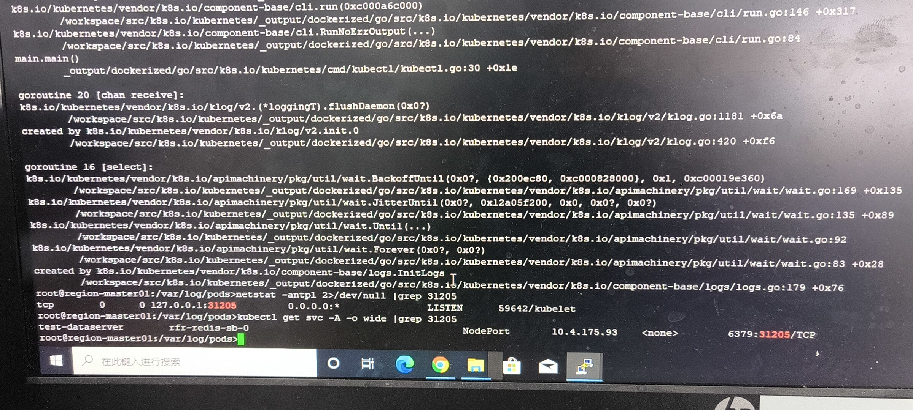
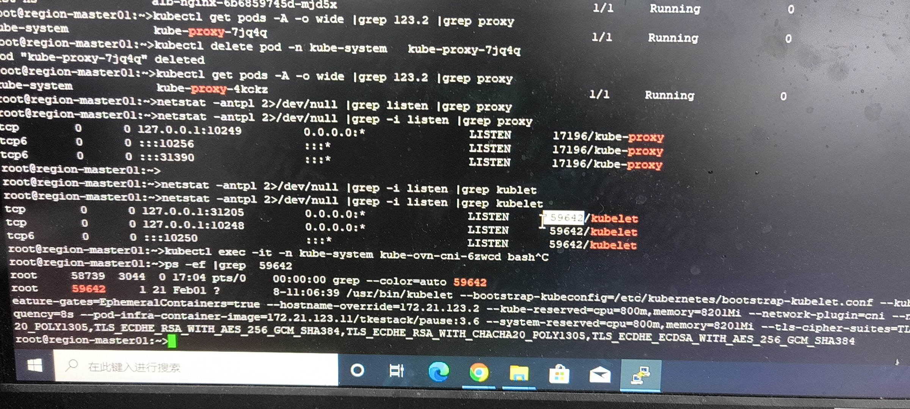
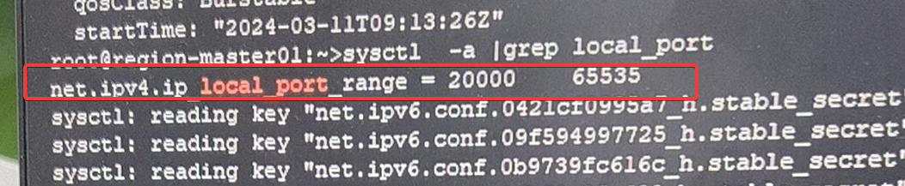
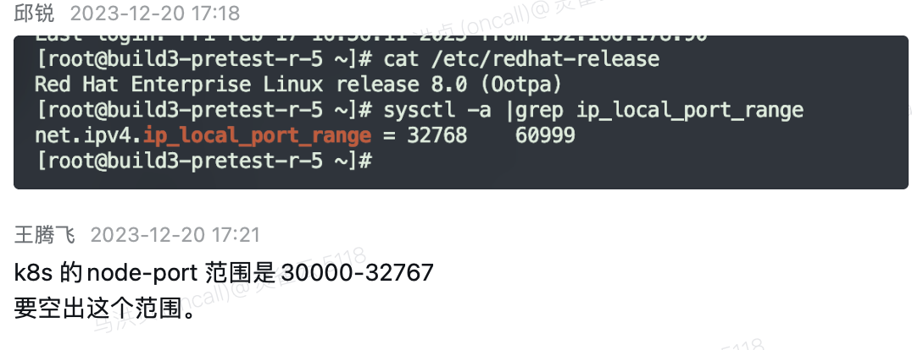

---
kind:
  - Troubleshooting
products:
  - Alauda Container Platform
  - Alauda DevOps
  - Alauda AI
  - Alauda Application Services
  - Alauda Service Mesh
  - Alauda Developer Portal
ProductsVersion:
  - 4.1.0,4.2.x
---
<!-- A type of document that involves encountering a fault, diagnosing it, performing root cause analysis, and providing solutions. -->

# 端口冲突导致 exec pod 失败

无法 exec 进入节点上的所有 pod（包括主机网络和容器网络的 pod） 执行 exec 命令出现错误，连接到 31205 端口 kubelet 日志中存在报错

## Cause
- kubelet 监听的端口与 NodePort 类型 Service 的端口 31205 冲突
- kube-apiserver 未配置 service-node-port-range 参数
- 系统参数中端口范围配置不正确

## Resolution
- 修改系统参数中的端口号范围配置

## [workaround]

## [Related Information]
**Screenshots**

- Environment: Kubernetes (ACP 3.12.0), CNI: Kube-OVN overlay 组网
- kubelet
- kube-apiserver
- NodePort
- 31205
- service-node-port-range
- Component: Kubelet
- Page ID: 195494635
- Original Title: 端口冲突导致 exec pod 失败
