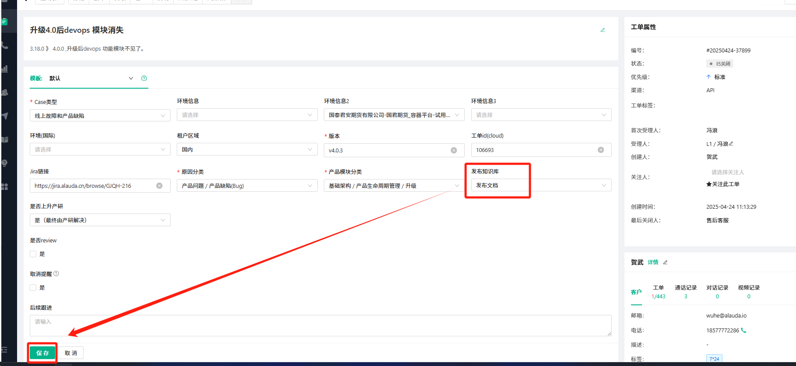
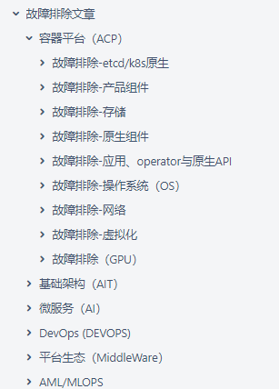
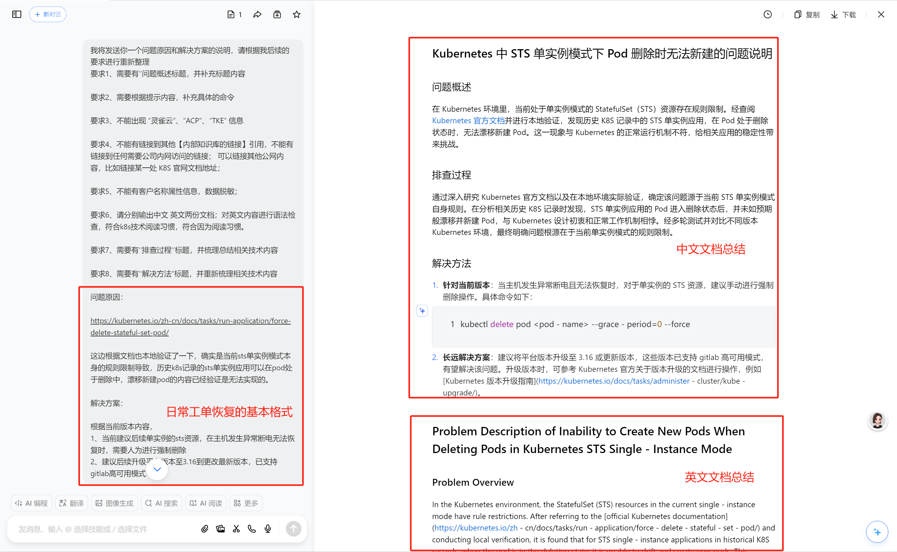

---
kind:
  - Troubleshooting
products:
  - Alauda Container Platform
  - Alauda DevOps
  - Alauda AI
  - Alauda Application Services
  - Alauda Service Mesh
  - Alauda Developer Portal
ProductsVersion:
  - 4.1.0,4.2.x
---
<!-- A type of document that involves encountering a fault, diagnosing it, performing root cause analysis, and providing solutions. -->

# Udesk同步文档中转站

文档中出现客户名称属性信息 存在内部知识库链接或需内网访问的链接 未使用代码块宏而使用截图

## Cause
- 未进行数据脱敏处理
- 引用了内部资源链接
- 未遵循代码块使用规范
- 版本适用性说明缺失
- 命令执行上下文不明确

## Resolution
- 使用【代码块】宏替代截图
- 删除代码中的中文注释
- 替换内部链接为公网资源链接
- 在文档头部添加版本适用说明
- 使用`kubelet`等明确位置前缀修饰命令
- 添加kb-s2标签并通过checklist审核

## [workaround]
- 通过DeepSeek工具进行内容重构
- 手动添加kb-s2标签发布到AC前台
- 在评论区补充jiar记录链接

## [Related Information]
**Screenshots**

- Environment: 版本信息自动从工单提取，需手动补充核心技术组件名称（如kubelet）和问题核心词汇（如升级）
- /pages/viewpage.action?pageId=196903982
- kb-troubleshooting-article
- kb-s2
- jiar
- alaudabk
- confluence.-rotc空间
- Component: Kubelet
- Page ID: 196903982
- Original Title: Udesk同步文档中转站
