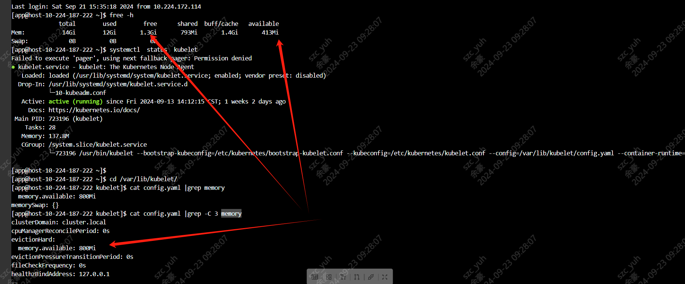
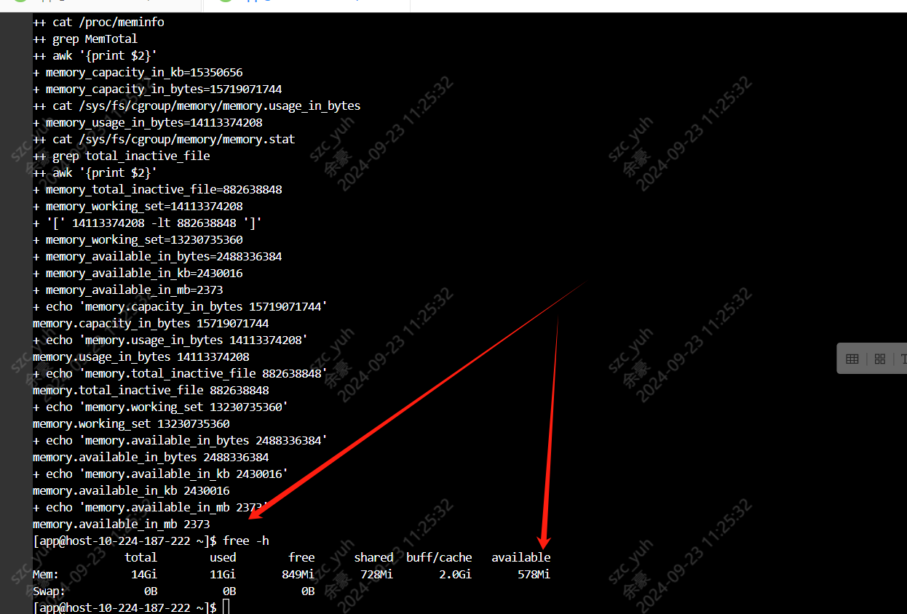

---
kind:
  - Troubleshooting
products:
  - Alauda Container Platform
  - Alauda DevOps
  - Alauda AI
  - Alauda Application Services
  - Alauda Service Mesh
  - Alauda Developer Portal
ProductsVersion:
  - 4.1.0,4.2.x
---
<!-- A type of document that involves encountering a fault, diagnosing it, performing root cause analysis, and providing solutions. -->

# 节点压力驱逐策略未生效

配置内存硬驱逐策略后未触发节点驱逐

## Cause
- kubelet通过cgroupfs计算memory.available值，与free命令显示结果存在差异

## Resolution
- 通过kubelet官方脚本验证实际计算的memory.available值，参考https://kubernetes.io/zh-cn/docs/concepts/scheduling-eviction/node-pressure-eviction/

## [workaround]

## [Related Information]
**Screenshots**

- Environment: 通用
- kubelet config.yaml
- evictionHard.memory.available
- cgroupfs
- /var/lib/kubelet/config.yaml
- memory.available计算脚本
- Component: Kubelet
- Page ID: 242092962
- Original Title: 节点压力驱逐策略未生效
