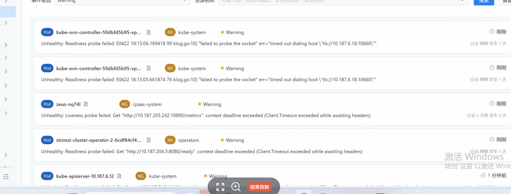
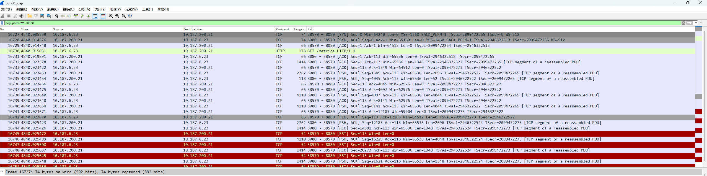
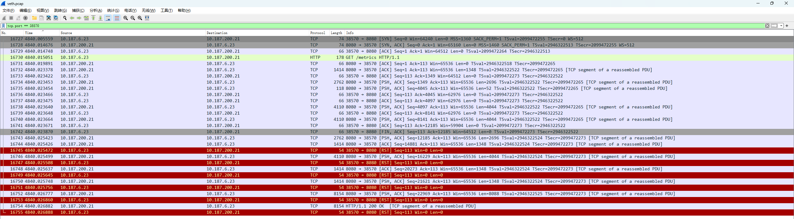
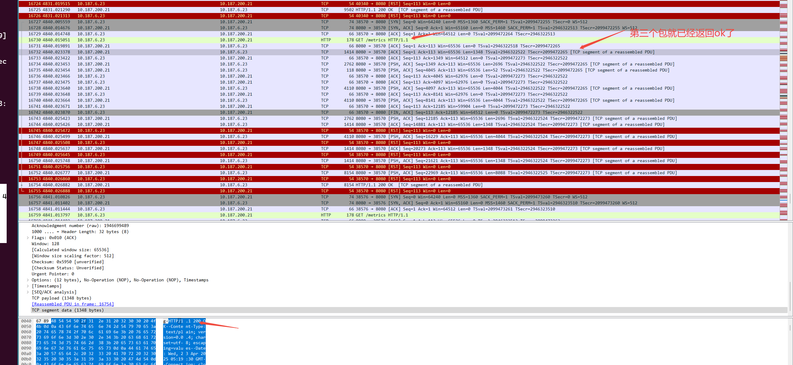
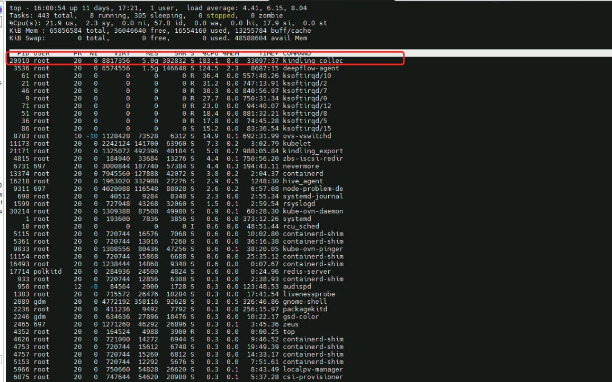

---
kind:
  - Troubleshooting
products:
  - Alauda Container Platform
  - Alauda DevOps
  - Alauda AI
  - Alauda Application Services
  - Alauda Service Mesh
  - Alauda Developer Portal
ProductsVersion:
  - 4.1.0,4.2.x
---
<!-- A type of document that involves encountering a fault, diagnosing it, performing root cause analysis, and providing solutions. -->

# 国泰君安的kubelet 健康检查偶现Timeout

所有Pod偶现健康检查失败，报io/timeout，约每小时一次

## Cause
- 监控工具deepflow/kindling-collect可能通过ebpf截获报文
- 节点CPU使用率较高

## Resolution
- 卸载deepflow和kindling-collect监控插件

## [workaround]
- 临时禁用deepflow和kindling-collect监控组件

## [Related Information]
**Screenshots**

- Environment: CNI: kube-ovn underlay, ACP 3.18.1
- kubelet
- kube-ovn
- deepflow
- kindling-collect
- Component: Kubelet
- Page ID: 282657582
- Original Title: 国泰君安的kubelet 健康检查偶现Timeout
