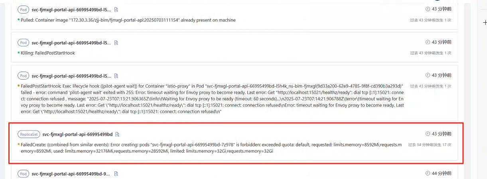

---
kind:
  - Troubleshooting
products:
  - Alauda Container Platform
  - Alauda DevOps
  - Alauda AI
  - Alauda Application Services
  - Alauda Service Mesh
  - Alauda Developer Portal
ProductsVersion:
  - 4.1.0,4.2.x
---
<!-- A type of document that involves encountering a fault, diagnosing it, performing root cause analysis, and providing solutions. -->

# 调用链异常导致业务服务组件无法启动

业务服务组件无法启动 调用链异常 资源不足事件

## Cause
- 资源不足

## Resolution
- 将服务迁移至资源充足的节点（例如节点174）

## [workaround]

## [Related Information]
**Screenshots**

- Environment: 3.12.0
- 节点资源
- kubelet日志
- Component: Kubelet
- Page ID: 321043622
- Original Title: 微服务-调用链异常导致业务服务组件无法启动-113578
