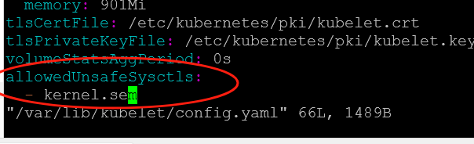

---
kind:
  - Troubleshooting
products:
  - Alauda Container Platform
  - Alauda DevOps
  - Alauda AI
  - Alauda Application Services
  - Alauda Service Mesh
  - Alauda Developer Portal
ProductsVersion:
  - 4.1.0,4.2.x
---
<!-- A type of document that involves encountering a fault, diagnosing it, performing root cause analysis, and providing solutions. -->

# 更改Centos节点sem内核参数配置

容器内sem参数不生效

## Cause
- kernel.sem是命名空间级参数，需在Pod级别单独配置

## Resolution
- 修改/var/lib/kubelet/config.yaml添加allowedUnsafeSysctls配置
- 添加配置项：allowedUnsafeSysctls:
- kernel.sem
- 重启kubelet服务生效
- 在Pod配置中通过securityContext.sysctls设置参数

## [workaround]

## [Related Information]
**Screenshots**

- Environment: 3.12.2
- /var/lib/kubelet/config.yaml
- allowedUnsafeSysctls
- kubelet
- securityContext.sysctls
- kernel.sem
- Component: Kubelet
- Page ID: 325910977
- Original Title: 容器平台-其他-更改Centos节点sem内核参数配置-113704
