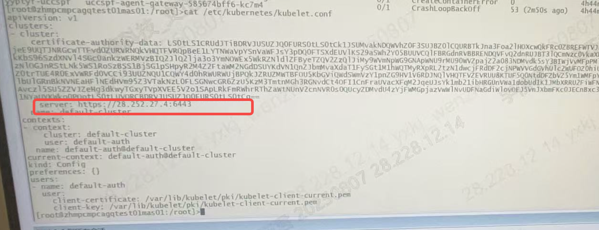

---
kind:
  - Troubleshooting
products:
  - Alauda Container Platform
  - Alauda DevOps
  - Alauda AI
  - Alauda Application Services
  - Alauda Service Mesh
  - Alauda Developer Portal
ProductsVersion:
  - 4.1.0,4.2.x
---
<!-- A type of document that involves encountering a fault, diagnosing it, performing root cause analysis, and providing solutions. -->

# 3.12集群节点状态同步异常

vip6443返回超时 三个master节点中两个显示异常

## Cause
- vip节点关机导致vip6443不可达
- kubelet.conf配置中的server地址未使用vip导致部分节点未报异常

## Resolution
- 修复vip节点确保vip可用
- 检查kubelet配置中server地址配置

## [workaround]

## [Related Information]
**Screenshots**

- Environment: 3.12.2
- kubelet.conf
- 6443端口
- vip
- master节点
- Component: Kubelet
- Page ID: 327812514
- Original Title: 容器平台-3.12集群节点状态同步异常-114613
