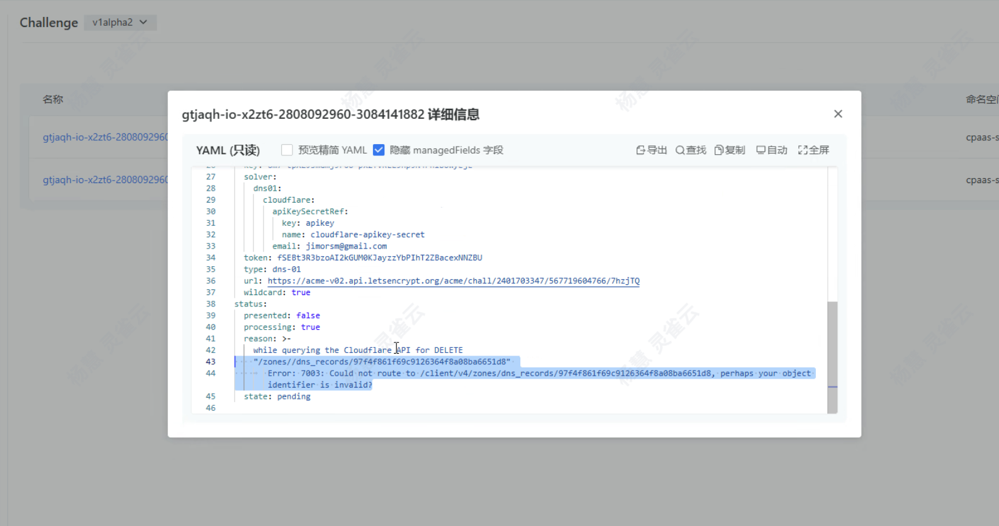
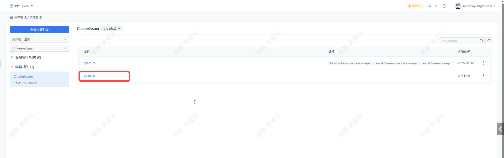
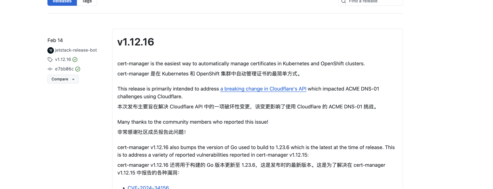
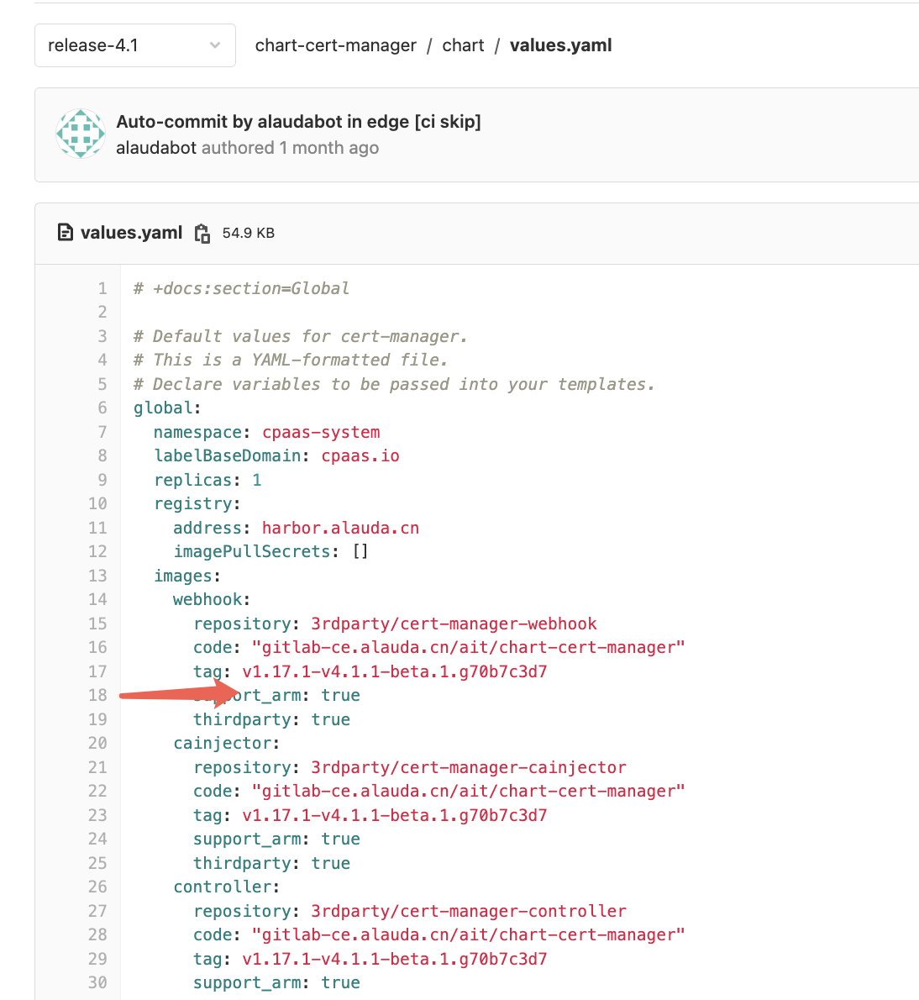
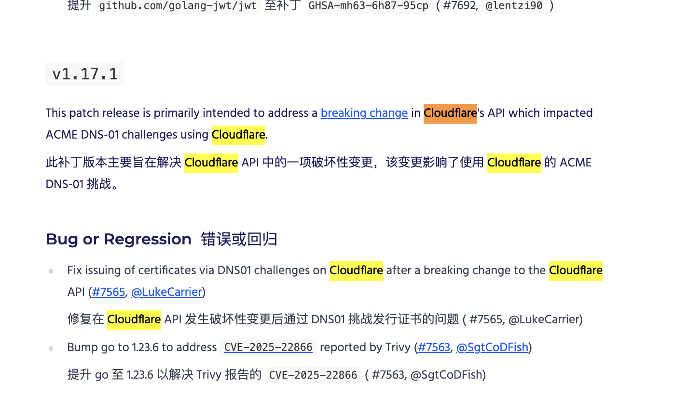

---
kind:
  - Troubleshooting
products:
  - Alauda Container Platform
  - Alauda DevOps
  - Alauda AI
  - Alauda Application Services
  - Alauda Service Mesh
  - Alauda Developer Portal
ProductsVersion:
  - 4.1.0,4.2.x
---
<!-- A type of document that involves encountering a fault, diagnosing it, performing root cause analysis, and providing solutions. -->

# cert

cert-manager报错 对接ACME申请证书失败（之前成功）

## Cause
- cloudflare api发生变更

## Resolution
- 升级到平台4.1版本（对应cert-manager 1.17版本）

## [workaround]

## [Related Information]
**Screenshots**

- Environment: 3.18.1
- cert-manager
- acme
- cloudflare api
- kubelet证书
- github.com/cert-manager/cert-manager/issues/7540
- Component: Kubelet
- Page ID: 333316499
- Original Title: 基础架构-产品组件-cert-manager报错-114979
