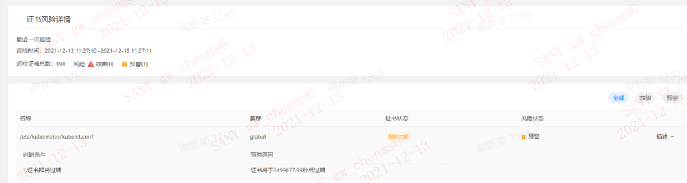
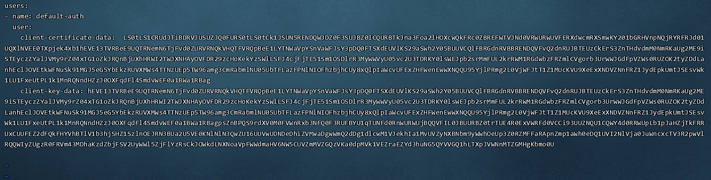

---
kind:
  - Troubleshooting
products:
  - Alauda Container Platform
  - Alauda DevOps
  - Alauda AI
  - Alauda Application Services
  - Alauda Service Mesh
  - Alauda Developer Portal
ProductsVersion:
  - 4.1.0,4.2.x
---
<!-- A type of document that involves encountering a fault, diagnosing it, performing root cause analysis, and providing solutions. -->

# kubelet.conf证书过期问题（已废弃）

平台巡检功能检测到kubelet.conf证书过期告警 /etc/kubernetes/kubelet.conf证书文件索引与其他文件内容不一致 通过命令验证证书过期时间显示证书已过期

## Cause
- kubelet.conf证书未正确续期
- 平台证书同步机制存在延迟(默认4小时同步一次)

## Resolution
- 备份原始文件: cp /etc/kubernetes/kubelet.conf /cpaas/
- 生成新证书并更新kubelet.conf: 执行openssl genrsa到sed -i的完整续期流程
- 验证证书有效期: cat /etc/kubernetes/kubelet.conf | grep client-certificate-data: | awk '{print $NF}' | base64 -d > 1.pem && openssl x509 -noout -dates -in 1.pem
- 重启kubelet: systemctl restart kubelet
- 必要时重启平台组件: 重启zeus和courier组件的pod

## [workaround]

## [Related Information]
**Screenshots**

- Environment: 3.4.X,3.0.X,3.3.X
- /etc/kubernetes/kubelet.conf
- /etc/kubernetes/pki/ca.crt
- /etc/kubernetes/pki/ca.key
- client-certificate-data
- client-key-data
- zeus
- courier
- Component: Kubelet
- Page ID: 98893033
- Original Title: kubelet.conf证书过期问题（已废弃）
