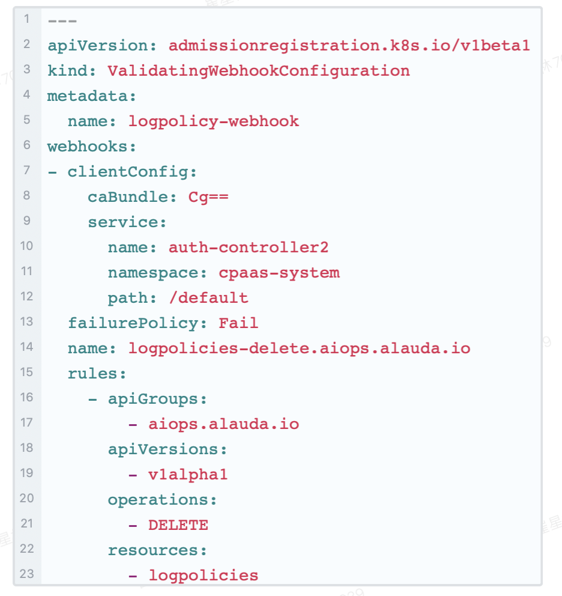

---
kind:
  - Troubleshooting
products:
  - Alauda Container Platform
  - Alauda DevOps
  - Alauda AI
  - Alauda Application Services
  - Alauda Service Mesh
  - Alauda Developer Portal
ProductsVersion:
  - 4.1.0,4.2.x
---
<!-- A type of document that involves encountering a fault, diagnosing it, performing root cause analysis, and providing solutions. -->

# 3.4.2平台日志存储策略修改无法持久生效

日志存储策略修改后自动重置为默认保留时间

## Cause
- logpolicy资源被删除重建

## Resolution
- 升级到3.4.4版本进行修复

## [workaround]
- 在global集群创建ValidatingWebhookConfiguration拦截DELETE操作:
apiVersion: admissionregistration.k8s.io/v1beta1
kind: ValidatingWebhookConfiguration
metadata:
  name: logpolicy-webhook
webhooks:
- clientConfig:
    caBundle: Cg==
    service:
      name: auth-controller2
      namespace: cpaas-system
      path: /default
  failurePolicy: Fail
  name: logpolicies-delete.aiops.alauda.io
  rules:
    - apiGroups:
        - aiops.alauda.io
      apiVersions:
        - v1alpha1
      operations:
        - DELETE
      resources:
        - logpolicies

## [Related Information]
**Screenshots**

- Environment: 3.4.2
- logpolicies
- ValidatingWebhookConfiguration
- auth-controller2
- cpaas-system
- aiops.alauda.io/v1alpha1
- Component: Kubernetes
- Page ID: 101651491
- Original Title: 3.4.2平台日志存储策略修改无法持久生效
