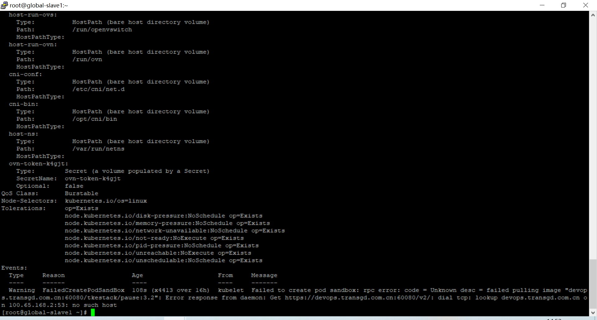

---
kind:
  - Troubleshooting
products:
  - Alauda Container Platform
  - Alauda DevOps
  - Alauda AI
  - Alauda Application Services
  - Alauda Service Mesh
  - Alauda Developer Portal
ProductsVersion:
  - 4.1.0,4.2.x
---
<!-- A type of document that involves encountering a fault, diagnosing it, performing root cause analysis, and providing solutions. -->

# 3.6

计算节点显示异常 k8s组件无法正常运行 Pod无法解析平台vip域名

## Cause
- 新增节点未配置平台VIP域名解析

## Resolution
- 在主机hosts文件中添加平台VIP域名解析记录

## [workaround]

## [Related Information]
**Screenshots**

- Environment: 3.6版本容器平台
- /etc/hosts
- 平台vip域名
- Component: Kubernetes
- Page ID: 108108303
- Original Title: 3.6-容器平台-产品生命周期管理-global集群添加节点后k8s组件无法正常运行
