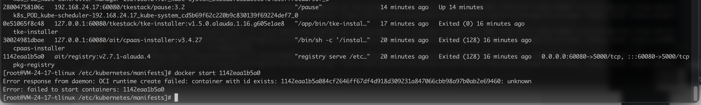

---
kind:
  - Troubleshooting
products:
  - Alauda Container Platform
  - Alauda DevOps
  - Alauda AI
  - Alauda Application Services
  - Alauda Service Mesh
  - Alauda Developer Portal
ProductsVersion:
  - 4.1.0,4.2.x
---
<!-- A type of document that involves encountering a fault, diagnosing it, performing root cause analysis, and providing solutions. -->

# 3.4.5

已有的三个容器全部退出 手动启动registry失败 清理后重新部署问题依旧

## Cause
- containerd存在问题导致容器启动失败

## Resolution
- 卸载containerd
- 执行清理脚本重新部署

## [workaround]

## [Related Information]
**Screenshots**

- Environment: 3.x
- containerd
- registry容器
- 清理脚本
- k8s组件
- Component: Kubernetes
- Page ID: 112050198
- Original Title: 3.4.5-安装部署-安装k8s步骤失败
