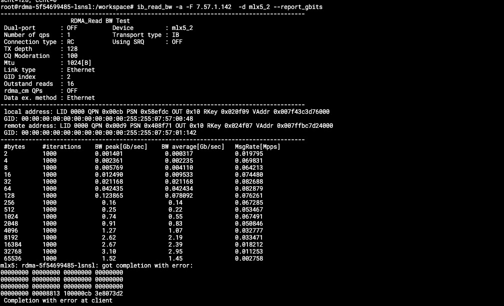
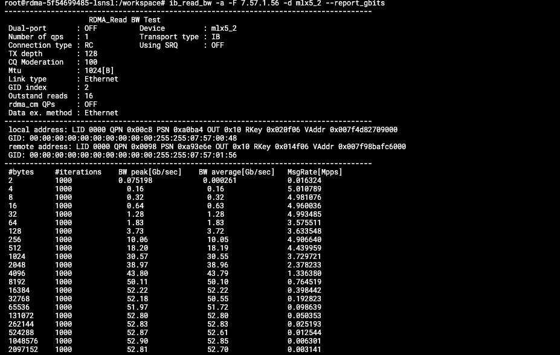
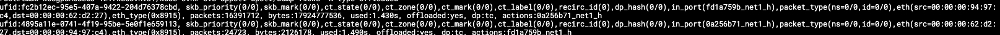
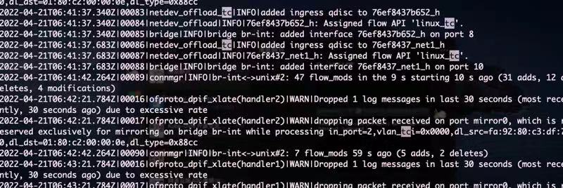

---
kind:
  - Troubleshooting
products:
  - Alauda Container Platform
  - Alauda DevOps
  - Alauda AI
  - Alauda Application Services
  - Alauda Service Mesh
  - Alauda Developer Portal
ProductsVersion:
  - 4.1.0,4.2.x
---
<!-- A type of document that involves encountering a fault, diagnosing it, performing root cause analysis, and providing solutions. -->

# 智能网卡跨节点带宽低且无流表卸载

跨节点 Pod 带宽极低 执行 ovs-appctl dpctl/dump-flows -m type=offloaded 无卸载流表

## Cause
- 使用智能网卡 pf 创建的 bond 网口导致流表卸载异常

## Resolution
- 删除 bond 网口直接使用智能网卡 pf
- 如需使用 bond 需在 pf 配置完 e-switch 后再创建 bond

## [workaround]

## [Related Information]
**Screenshots**

- bond 网口
- e-switch 配置
- ovs-vswitchd 日志
- tc 流表
- ovs-appctl dpctl/dump-flows -m type=offloaded
- Component: Kubernetes
- Page ID: 112058538
- Original Title: 智能网卡跨节点带宽低且无流表卸载
