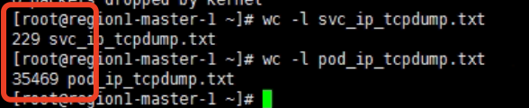
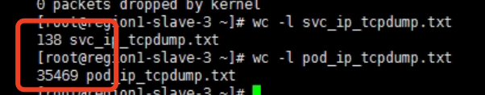

---
kind:
  - Troubleshooting
products:
  - Alauda Container Platform
  - Alauda DevOps
  - Alauda AI
  - Alauda Application Services
  - Alauda Service Mesh
  - Alauda Developer Portal
ProductsVersion:
  - 4.1.0,4.2.x
---
<!-- A type of document that involves encountering a fault, diagnosing it, performing root cause analysis, and providing solutions. -->

# Underlay 通过 Service IP 访问 Pod 带宽极低

Underlay 模式下，通过 Service IP 访问 Pod 带宽约为 400 KB/s 直接使用 Pod IP 访问带宽为 110 MB/s 通过 Service IP 访问时 Client 端发出的包数量明显大于 Server 端接收数量

## Cause
- OVN LB 的 DNAT 未修改 dst MAC，导致流量发往物理网关
- 物理网关可能对部分网络包进行限速/丢包处理

## Resolution
- 关闭网关的 ip redirect 功能（禁用 ICMP Redirect 消息）

## [workaround]

## [Related Information]
**Screenshots**

- Service IP
- Pod IP
- OVN LB
- DNAT
- 物理网关
- ICMP Redirect
- tcpdump -i ens224 -nn tcp and src host 10.0.32.77 and dst host 10.0.32.165
- Component: Kubernetes
- Page ID: 112064602
- Original Title: Underlay 通过 Service IP 访问 Pod 带宽极低
