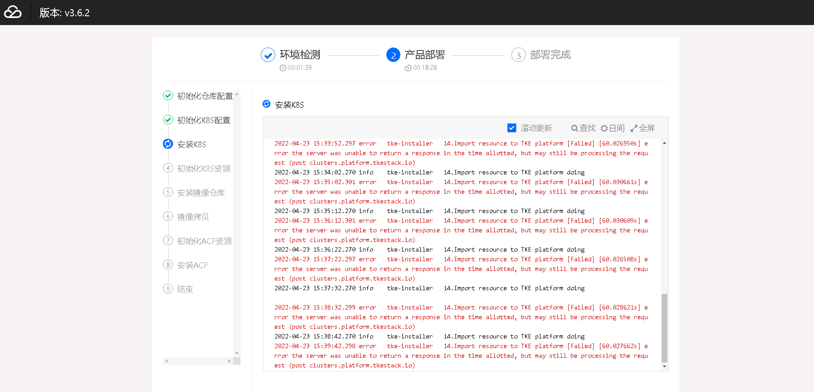
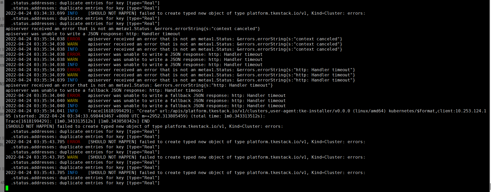

---
kind:
  - Troubleshooting
products:
  - Alauda Container Platform
  - Alauda DevOps
  - Alauda AI
  - Alauda Application Services
  - Alauda Service Mesh
  - Alauda Developer Portal
ProductsVersion:
  - 4.1.0,4.2.x
---
<!-- A type of document that involves encountering a fault, diagnosing it, performing root cause analysis, and providing solutions. -->

# 部署平台异常

部署平台卡在安装K8s阶段 error the server was unable to return a response in the time allotted (post cluster.platform.tkestack.io)

## Cause
- tke-platform-api容器内进行ssh IP whoami校验时耗时过长
- 节点sshd配置UseDNS yes导致校验延迟

## Resolution
- 修改/etc/ssh/sshd_config配置UseDNS no
- 执行systemctl restart sshd重启服务

## [workaround]

## [Related Information]
**Screenshots**

- Environment: 3.6.x及以上版本集群环境
- tke-platform-api
- sshd_config
- cluster.platform.tkestack.io
- UseDNS
- Component: Kubernetes
- Page ID: 115515643
- Original Title: 部署平台异常
