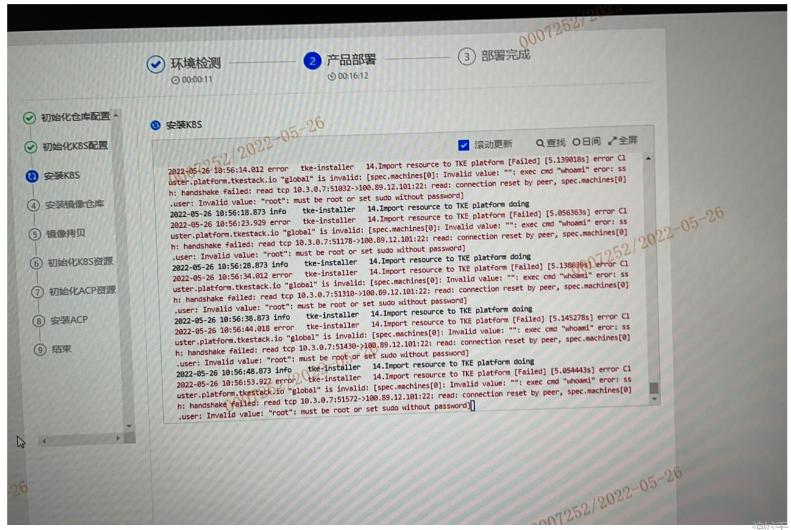
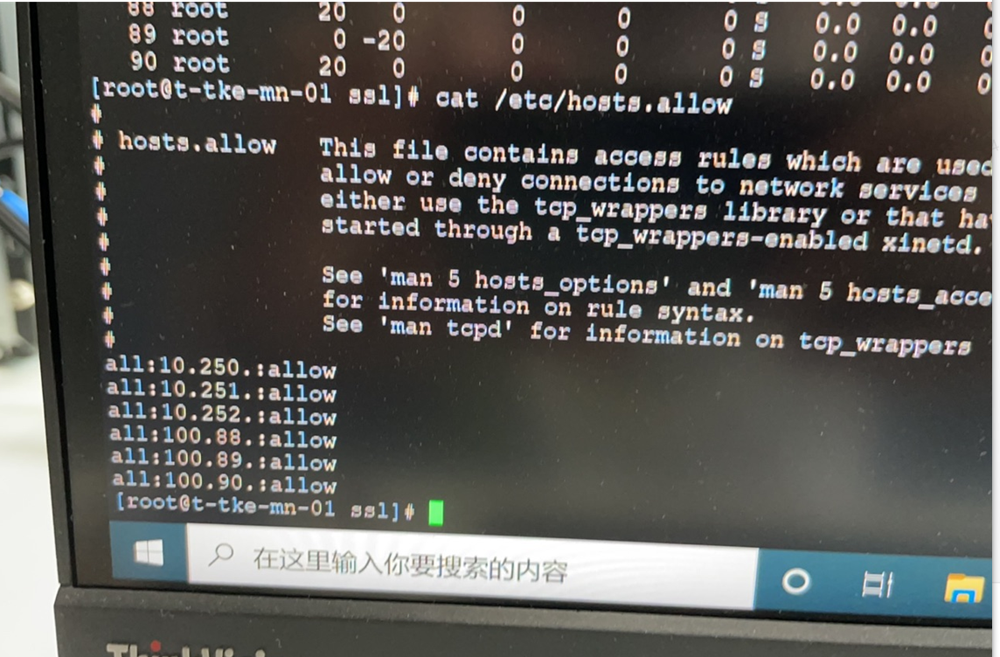

---
kind:
  - Troubleshooting
products:
  - Alauda Container Platform
  - Alauda DevOps
  - Alauda AI
  - Alauda Application Services
  - Alauda Service Mesh
  - Alauda Developer Portal
ProductsVersion:
  - 4.1.0,4.2.x
---
<!-- A type of document that involves encountering a fault, diagnosing it, performing root cause analysis, and providing solutions. -->

# 3.8部署

error C1 [uster.platform.tkestack.io "global" is invalid: [spec.machines[0]: Invalid value: "": exec cmd "whoami" error: ssh: handshake failed: read tcp 10.3.0.7:51032->100.89.12.101:22: read: connection reset by peer spec.machines[0] user: Invalid value: "root": must be root or set sudo without password

## Cause
- SSH connection to the target machine was blocked by security restrictions (e.g., /etc/hosts.allow)
- User permission configuration issue: non-root user without passwordless sudo

## Resolution
- Modify /etc/hosts.allow to allow necessary SSH connections
- Ensure the user is either root or has passwordless sudo configured

## [workaround]

## [Related Information]
**Screenshots**

- Environment: 3.8
- 22/tcp (SSH)
- /etc/hosts.allow
- tke-installer
- spec.machines configuration
- Component: Kubernetes
- Page ID: 115525096
- Original Title: 3.8部署-卡在安装k8s步骤
