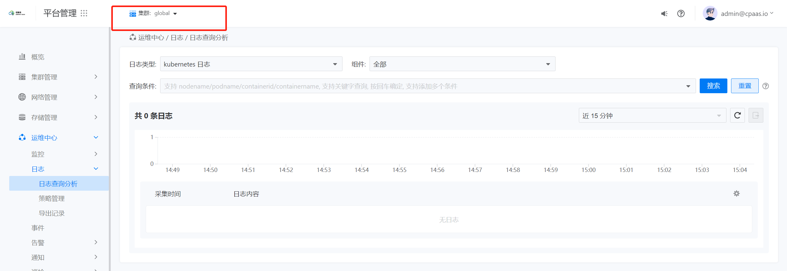

---
kind:
  - Troubleshooting
products:
  - Alauda Container Platform
  - Alauda DevOps
  - Alauda AI
  - Alauda Application Services
  - Alauda Service Mesh
  - Alauda Developer Portal
ProductsVersion:
  - 4.1.0,4.2.x
---
<!-- A type of document that involves encountering a fault, diagnosing it, performing root cause analysis, and providing solutions. -->

# 3.8.1

日志显示无数据 lanaya报错read kafka message error elasticsearch缺少kubernetes/log-system索引

## Cause
- nevermore向kafka写入超过1MB数据导致异常

## Resolution
- 应用razor组件hotfix镜像 build-harbor.alauda.cn/ait/razor:hotfix-kafka-config.2205201801

## [workaround]

## [Related Information]
**Screenshots**

- Environment: TKE 3.8.1
- razor
- kafka
- nevermore
- lanaya
- elasticsearch
- Component: Kubernetes
- Page ID: 115526848
- Original Title: 3.8.1-日志显示无数据
