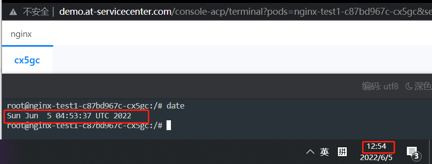
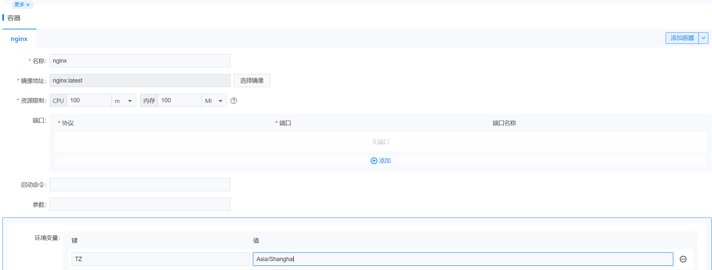
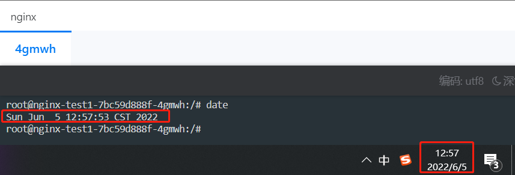

---
kind:
  - Troubleshooting
products:
  - Alauda Container Platform
  - Alauda DevOps
  - Alauda AI
  - Alauda Application Services
  - Alauda Service Mesh
  - Alauda Developer Portal
ProductsVersion:
  - 4.1.0,4.2.x
---
<!-- A type of document that involves encountering a fault, diagnosing it, performing root cause analysis, and providing solutions. -->

# 解决容器内时区不一致问题

JIRA Jira：

## Cause

## Resolution
- K8S集群中容器系统时间默认为 UTC 协调世界时间 （Universal Time Coordinated），与节点本地所属时区 CST （上海时间）相差8个小时。在容器使用过程中，当需要获取系统时间用于日志记录、[数据库](https://cloud.tencent.com/solution/database?fr
- 默认时间不支持直接以集群为单位进行修改，但可在单个容器内进行修改。
- ## 解决方案
- 首先我们起一个测试pod，不配置时区，看下容器内是什么时间
- service.cpaas.io/name: deployment-nginx-test1
- 下面我们用环境变量设置下时区

## [workaround]

## [Related Information]
**Screenshots**

- nginx
- /name
- 30
- 10
- 600
- /v1
- /creator
- /dev/termination-log
- 10680
- 54
- Component: Kubernetes
- Page ID: 115528554
- Original Title: 解决容器内时区不一致问题-通过设置环境变量同步时区
