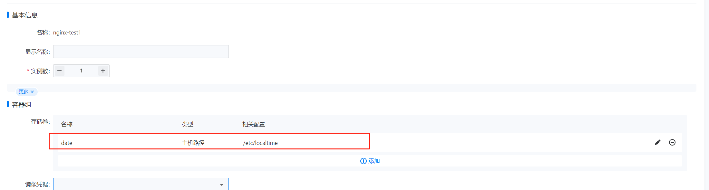
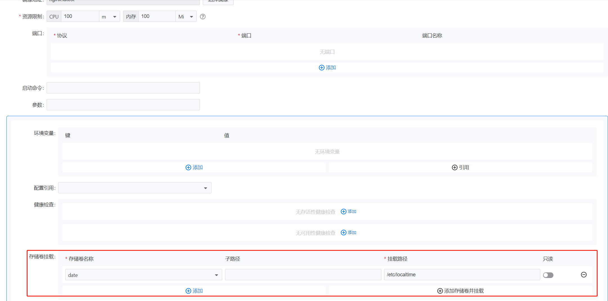
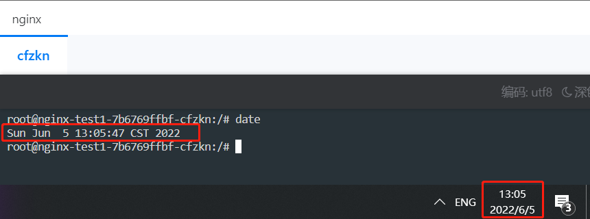

---
kind:
  - Troubleshooting
products:
  - Alauda Container Platform
  - Alauda DevOps
  - Alauda AI
  - Alauda Application Services
  - Alauda Service Mesh
  - Alauda Developer Portal
ProductsVersion:
  - 4.1.0,4.2.x
---
<!-- A type of document that involves encountering a fault, diagnosing it, performing root cause analysis, and providing solutions. -->

# 解决容器内时区不一致问题

容器内系统时间与节点本地时区相差8小时

## Cause
- 容器默认使用UTC时区

## Resolution
- 挂载节点/etc/localtime到容器/etc/localtime

## [workaround]

## [Related Information]
**Screenshots**

- Environment: K8S集群
- /etc/localtime
- volumes.hostPath
- volumeMounts.mountPath
- Component: Kubernetes
- Page ID: 115528562
- Original Title: 解决容器内时区不一致问题-通过挂载本地时区文件同步时区
