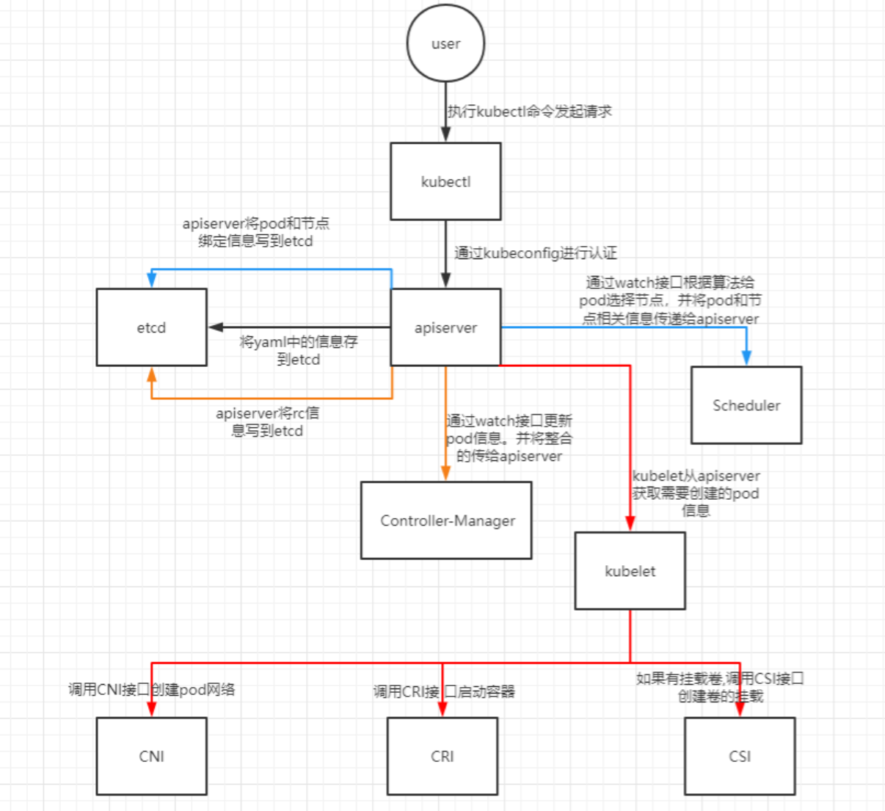

---
kind:
  - Troubleshooting
products:
  - Alauda Container Platform
  - Alauda DevOps
  - Alauda AI
  - Alauda Application Services
  - Alauda Service Mesh
  - Alauda Developer Portal
ProductsVersion:
  - 4.1.0,4.2.x
---
<!-- A type of document that involves encountering a fault, diagnosing it, performing root cause analysis, and providing solutions. -->

# Kubernetes中pod的创建流程

JIRA Jira：

## Cause

## Resolution

## [workaround]

## [Related Information]
**Screenshots**

- Environment: 通用
- kubectl
- apiserver
- etcd
- Controller-Manager
- Scheduler
- kubelet
- CNI
- CRI
- CSI
- kubeconfig
- watch接口
- Component: Kubernetes
- Page ID: 115528568
- Original Title: Kubernetes中pod的创建流程
