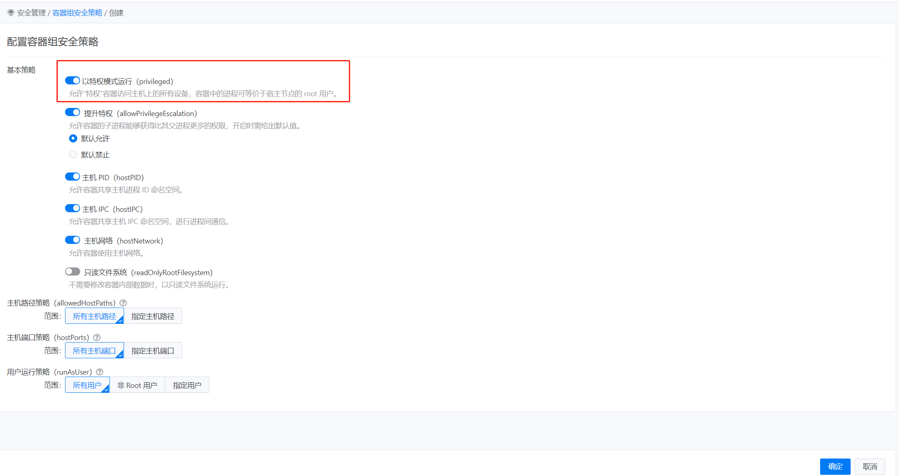

---
kind:
  - Troubleshooting
products:
  - Alauda Container Platform
  - Alauda DevOps
  - Alauda AI
  - Alauda Application Services
  - Alauda Service Mesh
  - Alauda Developer Portal
ProductsVersion:
  - 4.1.0,4.2.x
---
<!-- A type of document that involves encountering a fault, diagnosing it, performing root cause analysis, and providing solutions. -->

# 限制容器特权参数使用

JIRA Jira：

## Cause
- 平台默认允许容器特权参数(privileged: true)的使用

## Resolution
- 3.8之前版本: 容器平台管理视图-安全管理-容器组安全策略-立即配置勾选限制
- 3.8及之后版本: 平台管理视图-安全管理-容器组安全策略-立即配置勾选限制

## [workaround]

## [Related Information]
**Screenshots**

- Environment: 通用版本，特别注意3.8前后配置路径变化
- privileged: true
- 容器组安全策略
- securityContext
- Component: Kubernetes
- Page ID: 115528598
- Original Title: 容器平台-限制容器特权参数使用
