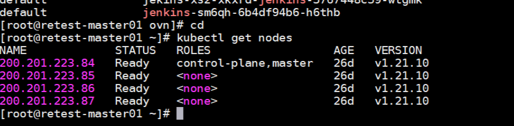
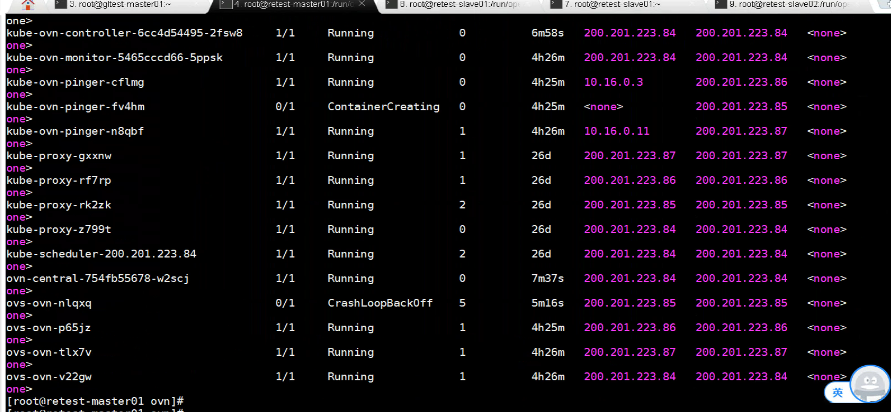
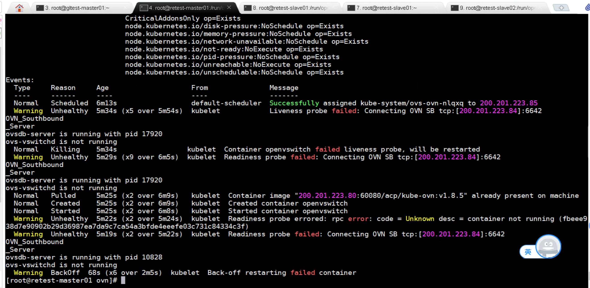
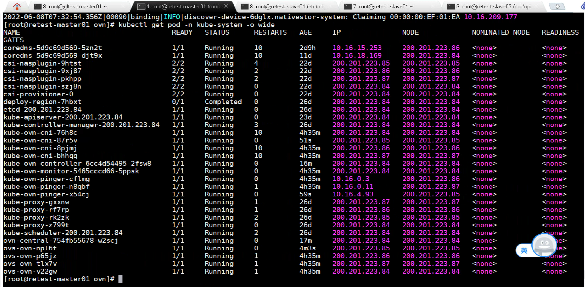

---
kind:
  - Troubleshooting
products:
  - Alauda Container Platform
  - Alauda DevOps
  - Alauda AI
  - Alauda Application Services
  - Alauda Service Mesh
  - Alauda Developer Portal
ProductsVersion:
  - 4.1.0,4.2.x
---
<!-- A type of document that involves encountering a fault, diagnosing it, performing root cause analysis, and providing solutions. -->

# 20220608

ovs-ovn pod启动失败 日志显示无法连接ovn sb db kubectl sbctl show缺少问题节点的chassis信息

## Cause
- 残留的旧DB文件导致连接异常

## Resolution
- 删除/etc/origin/openvswitch/conf.db文件并重启pod

## [workaround]

## [Related Information]
**Screenshots**

- Environment: ACP 3.8.1 + Kube-OVN v1.8.5
- ovn sb db
- /etc/origin/openvswitch/conf.db
- kubectl sbctl
- kube-ovn
- Component: Kubernetes
- Page ID: 115530852
- Original Title: 20220608-深信服ovs-ovn pod启动异常
