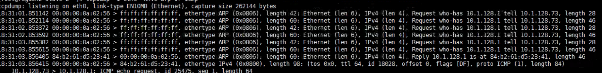
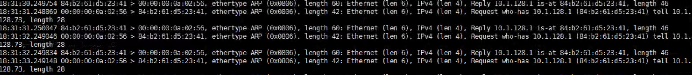
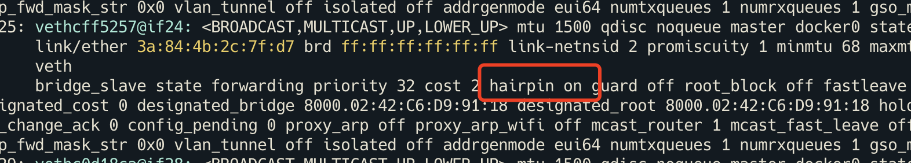

---
kind:
  - Troubleshooting
products:
  - Alauda Container Platform
  - Alauda DevOps
  - Alauda AI
  - Alauda Application Services
  - Alauda Service Mesh
  - Alauda Developer Portal
ProductsVersion:
  - 4.1.0,4.2.x
---
<!-- A type of document that involves encountering a fault, diagnosing it, performing root cause analysis, and providing solutions. -->

# Underlay 模式 Pod 长时间处于 ContainerCreating 状态

Pod 长时间处于 ContainerCreating 状态 CNI 报错 network not ready 同一时间存在两个源 MAC 地址相同的 ARP 请求

## Cause
- ARP 请求广播包被送回节点网卡导致 OVS fdb 错误更新
- VMWare 网络配置导致 ARP 响应被 drop

## Resolution
- 关闭交换机或网桥的 hairpin 功能
- 修改 VMWare 主机的 Net.ReversePathFwdCheckPromisc 配置为 1

## [workaround]

## [Related Information]
**Screenshots**

- OVS
- fdb
- ARP
- Net.ReversePathFwdCheckPromisc
- hairpin 模式
- Component: Kubernetes
- Page ID: 115533013
- Original Title: Underlay 模式 Pod 长时间处于 ContainerCreating 状态
