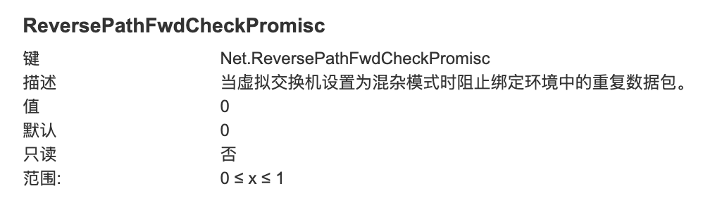

---
kind:
  - Troubleshooting
products:
  - Alauda Container Platform
  - Alauda DevOps
  - Alauda AI
  - Alauda Application Services
  - Alauda Service Mesh
  - Alauda Developer Portal
ProductsVersion:
  - 4.1.0,4.2.x
---
<!-- A type of document that involves encountering a fault, diagnosing it, performing root cause analysis, and providing solutions. -->

# Underlay 模式偶现 Pod 网络超时

Underlay 模式下，Pod 偶现网络超时

## Cause
- 交换机或网桥开启了 hairpin 功能
- VMWare 主机的 Net.ReversePathFwdCheckPromisc 配置问题

## Resolution
- 关闭交换机或网桥的 Hairpin 功能
- 将 VMWare 主机的 Net.ReversePathFwdCheckPromisc 配置设置为 1

## [workaround]

## [Related Information]
**Screenshots**

- Environment: K8s 节点为 VMWare 虚拟机
- VMWare 虚拟机
- Net.ReversePathFwdCheckPromisc
- 交换机
- 网桥
- hairpin 功能
- Component: Kubernetes
- Page ID: 115533037
- Original Title: Underlay 模式偶现 Pod 网络超时
