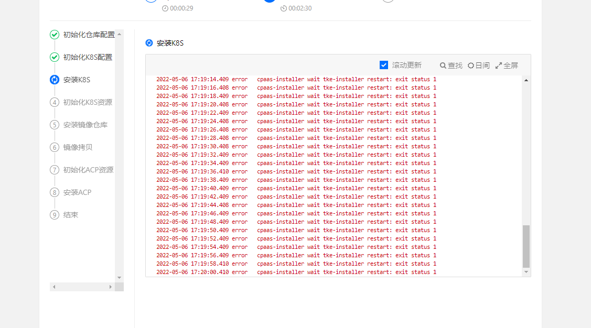
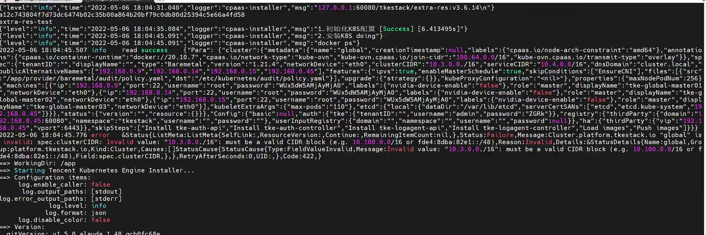

---
kind:
  - Troubleshooting
products:
  - Alauda Container Platform
  - Alauda DevOps
  - Alauda AI
  - Alauda Application Services
  - Alauda Service Mesh
  - Alauda Developer Portal
ProductsVersion:
  - 4.1.0,4.2.x
---
<!-- A type of document that involves encountering a fault, diagnosing it, performing root cause analysis, and providing solutions. -->

# 3.6.2

部署3.6.2失败 安装k8s异常退出

## Cause
- 部署表单中cidr格式填写错误

## Resolution
- 清理环境后重新部署
- 正确填写cidr配置

## [workaround]

## [Related Information]
**Screenshots**

- Environment: 3.6.2
- tke-installer容器
- cidr配置
- Component: Kubernetes
- Page ID: 115533166
- Original Title: 3.6.2-容器平台-部署3.6.2失败
