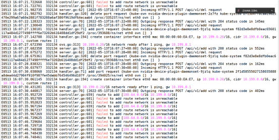

---
kind:
  - Troubleshooting
products:
  - Alauda Container Platform
  - Alauda DevOps
  - Alauda AI
  - Alauda Application Services
  - Alauda Service Mesh
  - Alauda Developer Portal
ProductsVersion:
  - 4.1.0,4.2.x
---
<!-- A type of document that involves encountering a fault, diagnosing it, performing root cause analysis, and providing solutions. -->

# 3.8.1

kube-ovn-pinger pod异常 ovn数据库不显示数据量信息 kube-ovn-cni日志报错: 主机节点无法添加ovn子网路由

## Cause
- hns3网卡驱动或内核问题导致UDP checksum错误
- geneve隧道无法正常解析ICMP结构

## Resolution
- ethtool -K XXX tx off
- 添加iptables条目去掉无谓的标签(kubeovn 1.7.1后默认加入)
- ovs-vsctl set open . external-ids:ovn-encap-csum=false

## [workaround]

## [Related Information]
**Screenshots**

- Environment: TKE 3.8.1 arm架构 麒麟OS物理机 Linux 4.19.90-24.4.v2101.ky10.aarch64
- kube-ovn-pinger
- kube-ovn-cni
- ovn-central
- ovs-ovn
- hns3网卡驱动
- geneve隧道
- iptables规则
- ovn-encap-csum配置
- Component: Kubernetes
- Page ID: 115533191
- Original Title: 3.8.1-基础架构-部署-部署arm架构卡在安装k8s上
