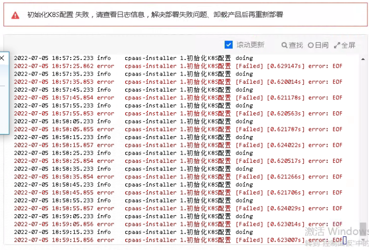
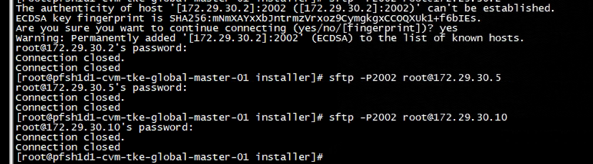

---
kind:
  - Troubleshooting
products:
  - Alauda Container Platform
  - Alauda DevOps
  - Alauda AI
  - Alauda Application Services
  - Alauda Service Mesh
  - Alauda Developer Portal
ProductsVersion:
  - 4.1.0,4.2.x
---
<!-- A type of document that involves encountering a fault, diagnosing it, performing root cause analysis, and providing solutions. -->

# 部署平台，执行到初始化k8s配置报错EOF

部署到初始化k8s配置后报错EOF cpaas-installer日志无有效信息 多次清理重部署仍复现

## Cause
- 主机ssh/sftp/scp存在安全加固限制
- sftp使用独立配置和端口导致连接失败

## Resolution
- 移除sftp/scp限制配置
- 修正ssh配置统一端口
- 部署完成后恢复安全加固

## [workaround]

## [Related Information]
**Screenshots**

- Environment: 通用
- sftp
- scp
- ssh配置
- 端口配置
- Component: Kubernetes
- Page ID: 120098881
- Original Title: 部署平台，执行到初始化k8s配置报错EOF
