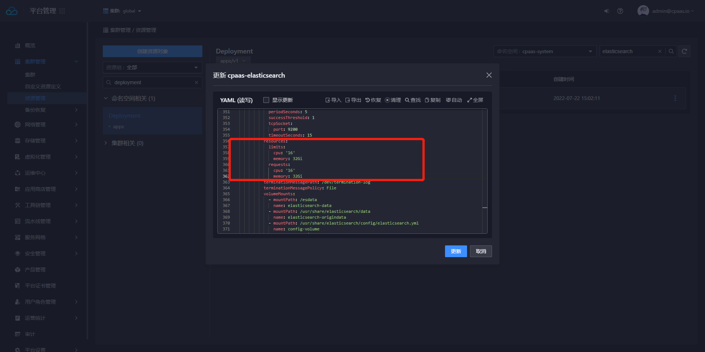

---
kind:
  - Troubleshooting
products:
  - Alauda Container Platform
  - Alauda DevOps
  - Alauda AI
  - Alauda Application Services
  - Alauda Service Mesh
  - Alauda Developer Portal
ProductsVersion:
  - 4.1.0,4.2.x
---
<!-- A type of document that involves encountering a fault, diagnosing it, performing root cause analysis, and providing solutions. -->

# 3.8

日志存储组件资源不足

## Cause
- cpaas-elasticsearch deployment资源配置不足

## Resolution
- 更新cpaas-elasticsearch deployment的resources配置
- 调整ES_JAVA_OPTS环境变量：-Xms8g -Xmx8g（需根据实际memory大小设置）

## [workaround]

## [Related Information]
**Screenshots**

- Environment: 3.8.*
- cpaas-elasticsearch
- ES_JAVA_OPTS
- resources.limits.memory
- /cpaas/data/elasticsearch/data
- /cpaas/data/elasticsearch/origindata
- Component: Kubernetes
- Page ID: 120113047
- Original Title: 3.8-平台日志存储组件扩容方案-纵向扩容
