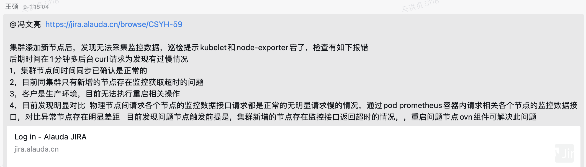
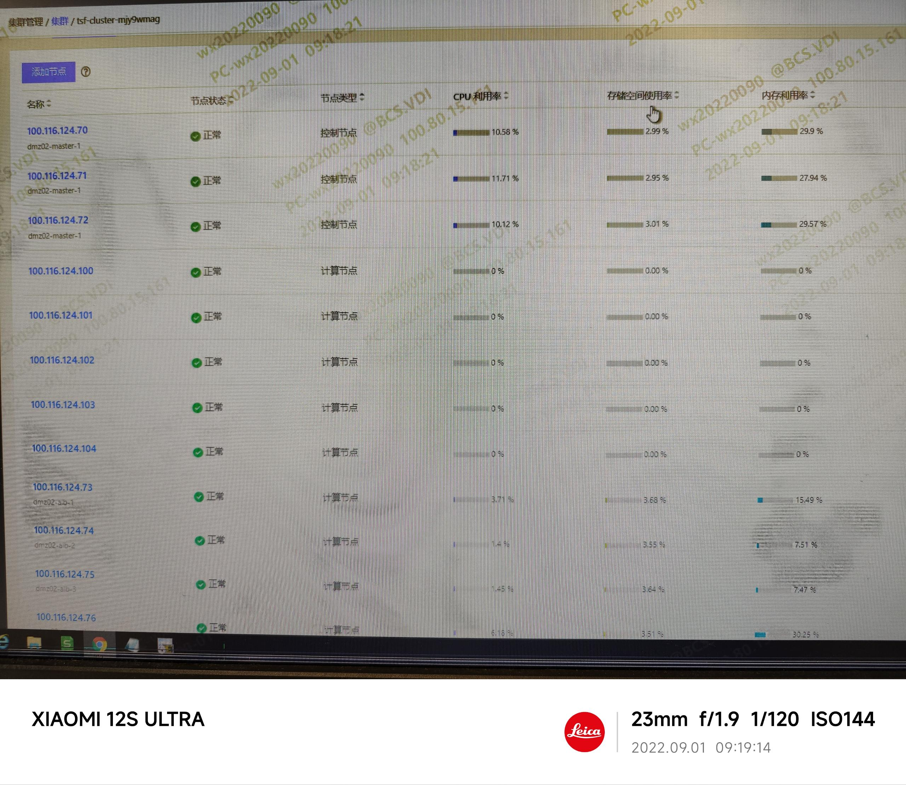
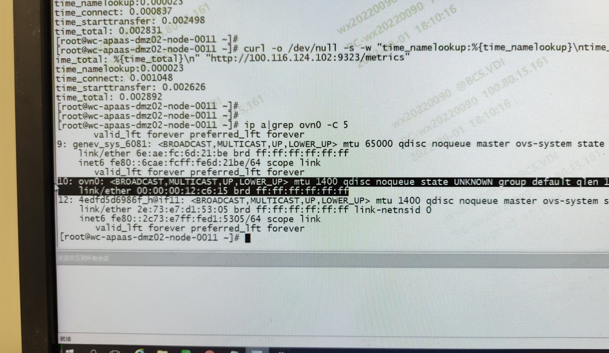
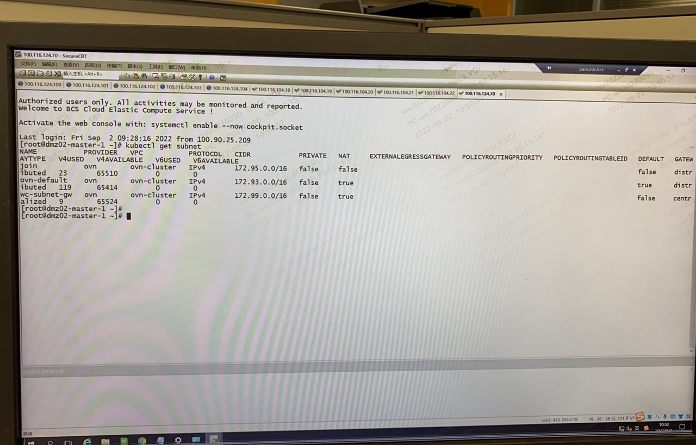
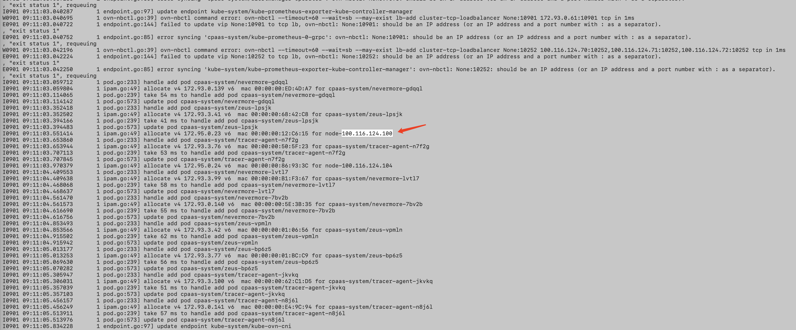
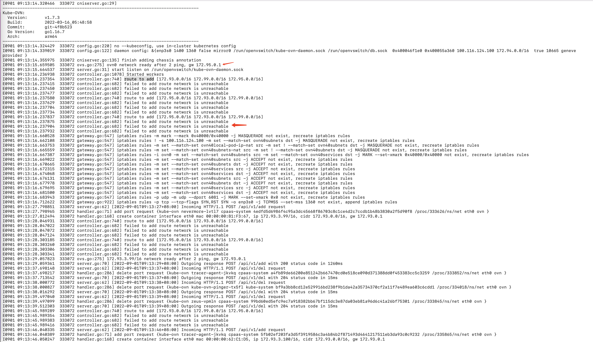

---
kind:
  - Troubleshooting
products:
  - Alauda Container Platform
  - Alauda DevOps
  - Alauda AI
  - Alauda Application Services
  - Alauda Service Mesh
  - Alauda Developer Portal
ProductsVersion:
  - 4.1.0,4.2.x
---
<!-- A type of document that involves encountering a fault, diagnosing it, performing root cause analysis, and providing solutions. -->

# 2022

新加节点上的Pod无法访问 新加节点的ovn0网卡没有IP地址 kube-ovn-cni日志显示配置子网路由报错

## Cause
- 麒麟系统安全组件kylin-security-daemon可能干扰网络配置
- kube-ovn组件未正确初始化网络接口

## Resolution
- 重启节点或重启kube-ovn组件
- 参考文档[Kube-OVN CNI报错，业务pod ping不通网关](/pages/viewpage.action?pageId=112041090)
- 参考文档[麒麟操作系统节点 ovn0 无 join 子网 IP](/pages/viewpage.action?pageId=115516708)

## [workaround]
- 临时重启kube-ovn-cni Pod或节点

## [Related Information]
**Screenshots**

- Environment: 操作系统：arm环境 麒麟系统；CNI版本：kube-ovn 1.7.3
- kube-ovn-controller
- kube-ovn-cni
- ovn0网卡
- 子网路由配置
- kylin-security-daemon
- Component: Kubernetes
- Page ID: 124687285
- Original Title: 2022-09-01 长沙银行添加节点，访问不了节点上Pod
