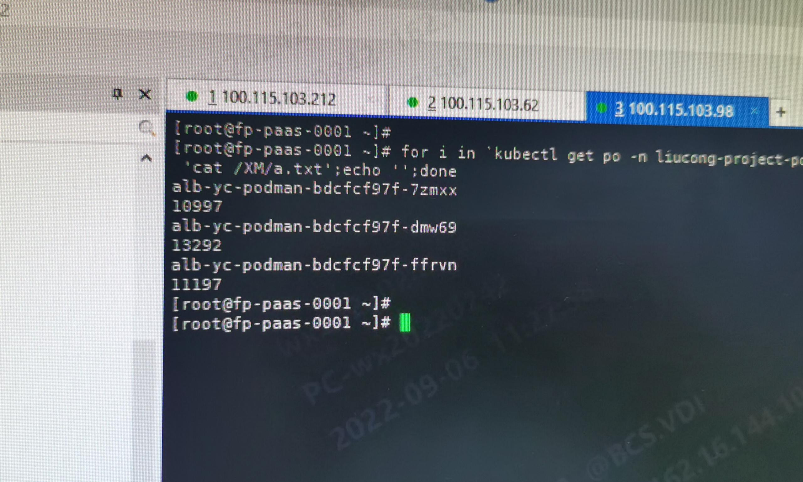
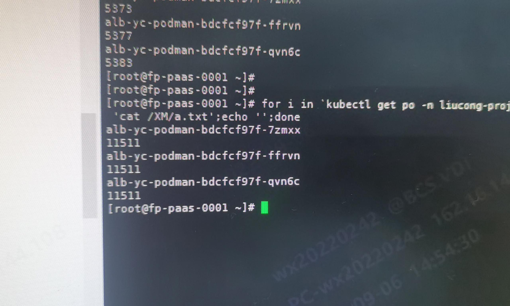

---
kind:
  - Troubleshooting
products:
  - Alauda Container Platform
  - Alauda DevOps
  - Alauda AI
  - Alauda Application Services
  - Alauda Service Mesh
  - Alauda Developer Portal
ProductsVersion:
  - 4.1.0,4.2.x
---
<!-- A type of document that involves encountering a fault, diagnosing it, performing root cause analysis, and providing solutions. -->

# acp 3.6.2 ovn

k8s svc lb 结果未准确轮询调度 ovn lb 结果不如预期均衡

## Cause
- ovn lb 基于 hash 算法实现

## Resolution
- 关闭 ovn lb 改用 ipvs 进行负载均衡

## [workaround]

## [Related Information]
**Screenshots**

- Environment: 操作系统：麒麟系统（arm环境）；CNI 版本：kube-ovn 1.7.3；其他信息：ACP 3.6.2
- ovn lb
- kube-ovn 1.7.3
- ipvs
- Component: Kubernetes
- Page ID: 124694743
- Original Title: acp 3.6.2 ovn-underlay 环境下lb负载不均衡
