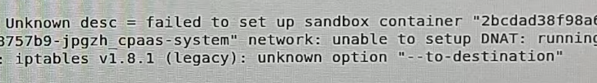
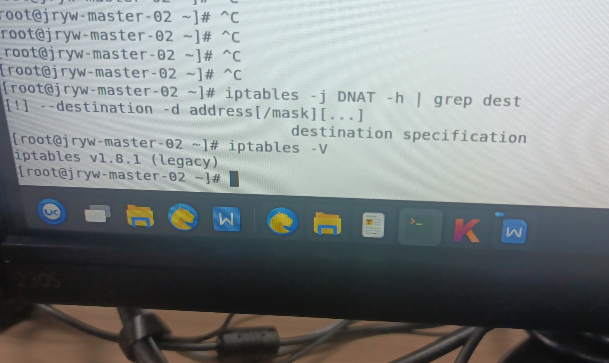
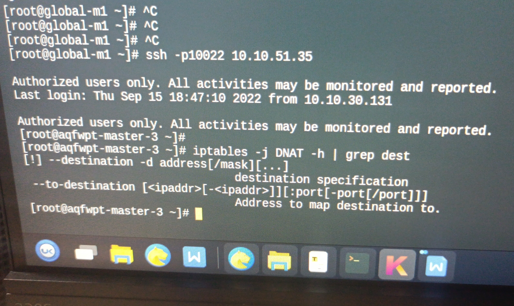
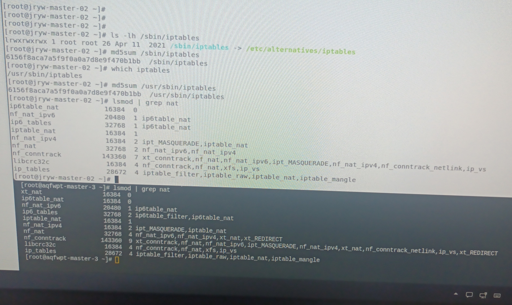
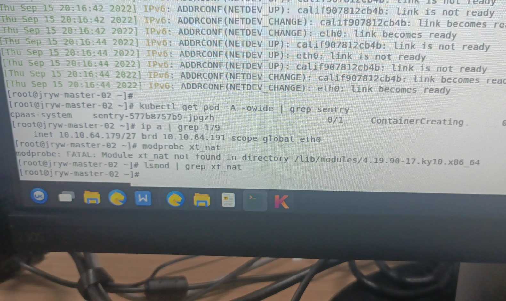

---
kind:
  - Troubleshooting
products:
  - Alauda Container Platform
  - Alauda DevOps
  - Alauda AI
  - Alauda Application Services
  - Alauda Service Mesh
  - Alauda Developer Portal
ProductsVersion:
  - 4.1.0,4.2.x
---
<!-- A type of document that involves encountering a fault, diagnosing it, performing root cause analysis, and providing solutions. -->

# iptables unknown option

iptables unknown option --to-destination error during TKE 3.6.3 sentry upgrade iptables -j DNAT -h | grep dest does not show --to-destination parameter xt_nat module not loaded (lsmod | grep nat shows missing module)

## Cause
- Nodes missing kernel files due to kernel upgrade without reboot after uninstalling old kernel

## Resolution

## [workaround]

## [Related Information]
**Screenshots**

- Environment: Kubernetes TKE 3.6.3
- iptables
- DNAT
- xt_nat
- kernel modules
- TKE upgrade
- Component: Kubernetes
- Page ID: 124697508
- Original Title: iptables unknown option --to-destination
