---
kind:
  - Troubleshooting
products:
  - Alauda Container Platform
  - Alauda DevOps
  - Alauda AI
  - Alauda Application Services
  - Alauda Service Mesh
  - Alauda Developer Portal
ProductsVersion:
  - 4.1.0,4.2.x
---
<!-- A type of document that involves encountering a fault, diagnosing it, performing root cause analysis, and providing solutions. -->

# 2022

大量容器网络Pod访问不了apiserver，健康检查失败导致crash重启 子网状态not ready导致节点缺少容器网络路由信息 Pod出现IP地址冲突（例如xdn5q Pod与其他Pod冲突）

## Cause
- kube-ovn-controller访问apiserver超时触发leader切换
- reconcileSubnet过程中出现portName不存在的错误
- IPAM模块存在releaseList和freeList切换问题导致地址分配冲突
- 压测环境下大量Pod导致kube-ovn-controller处理延迟

## Resolution
- 等待kube-ovn-controller完成leader切换并自动更新subnet状态
- 检查并确保subnet状态更新为ready后节点路由自动添加

## [workaround]

## [Related Information]
**Screenshots**
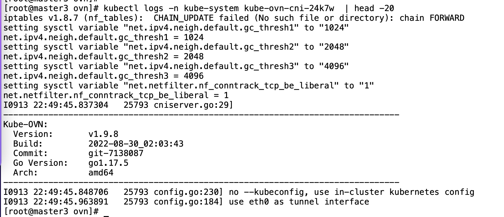
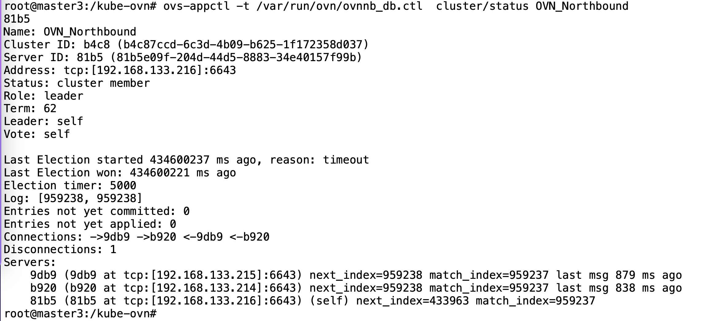
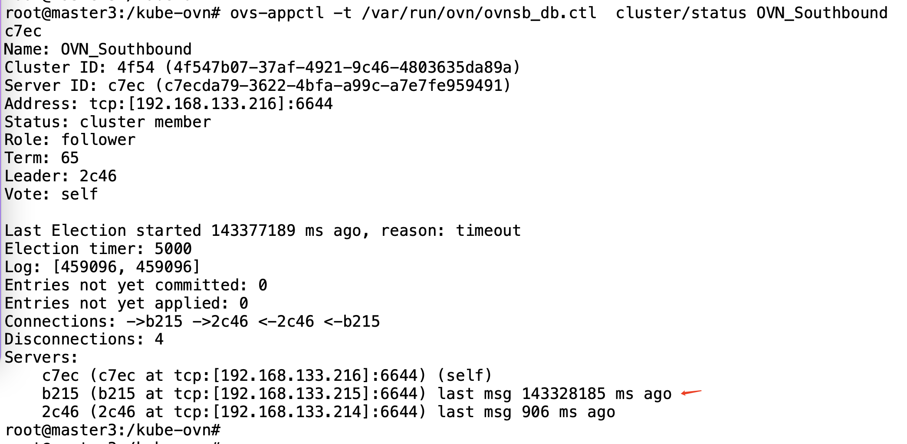
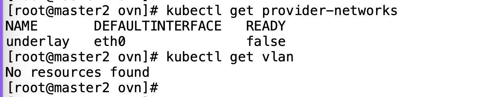
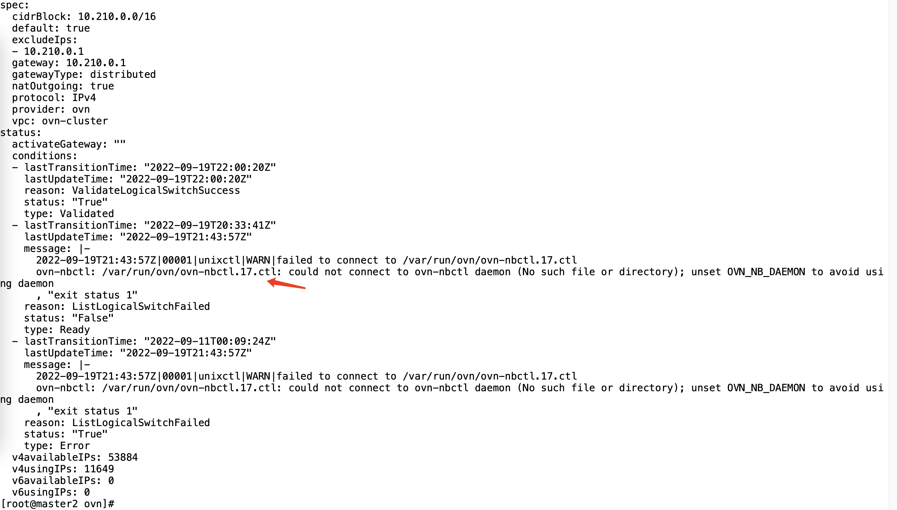
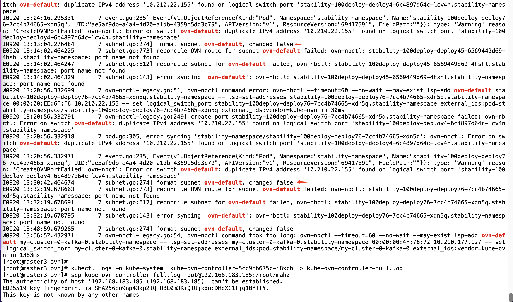
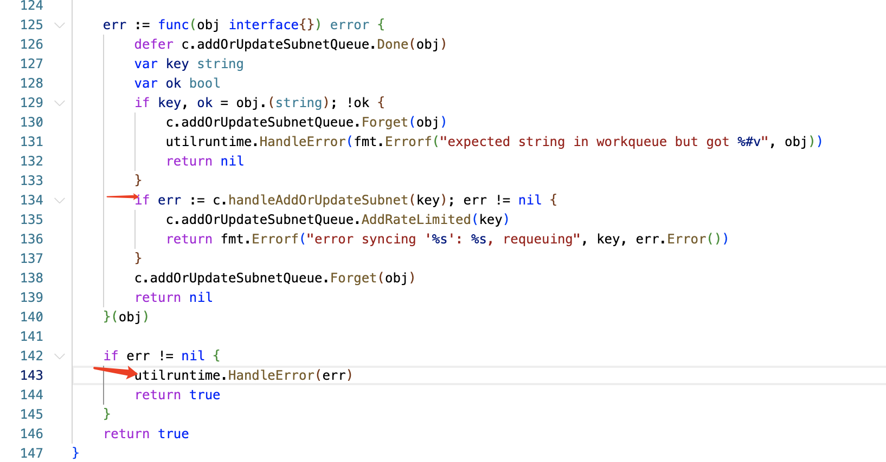
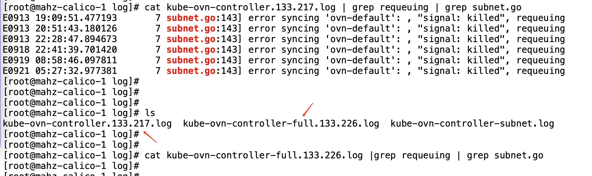
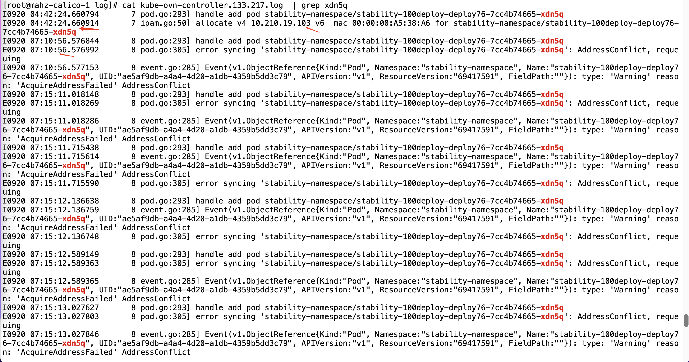
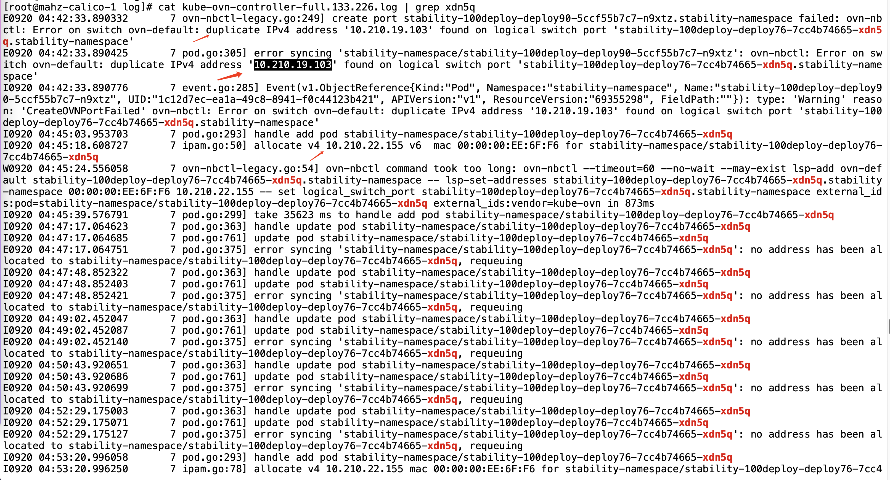
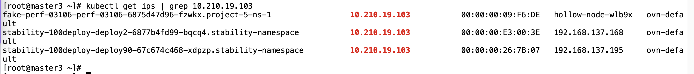
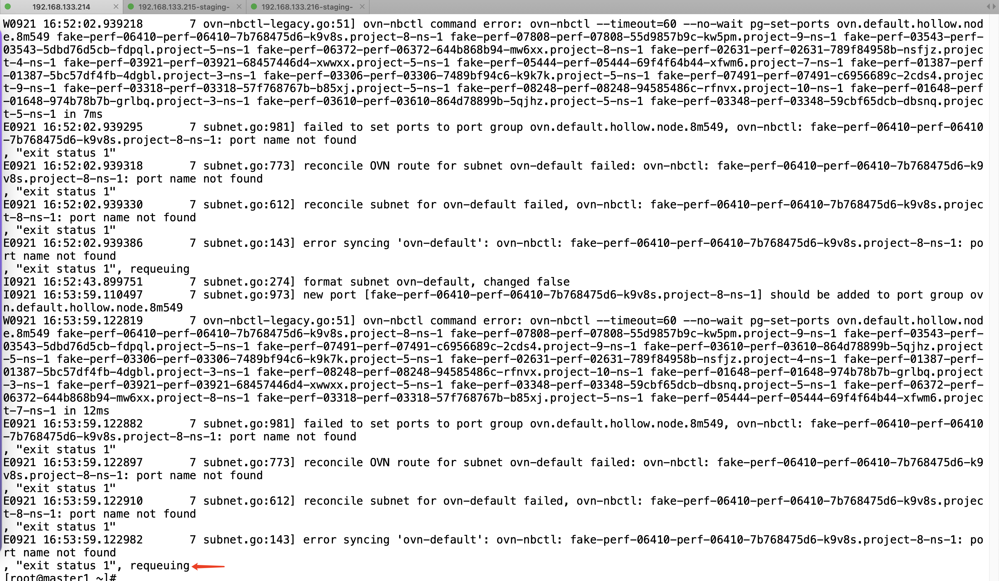
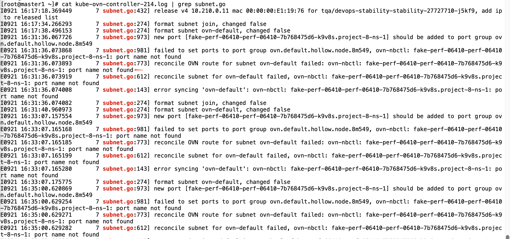
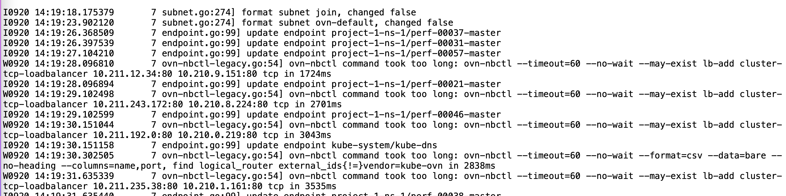
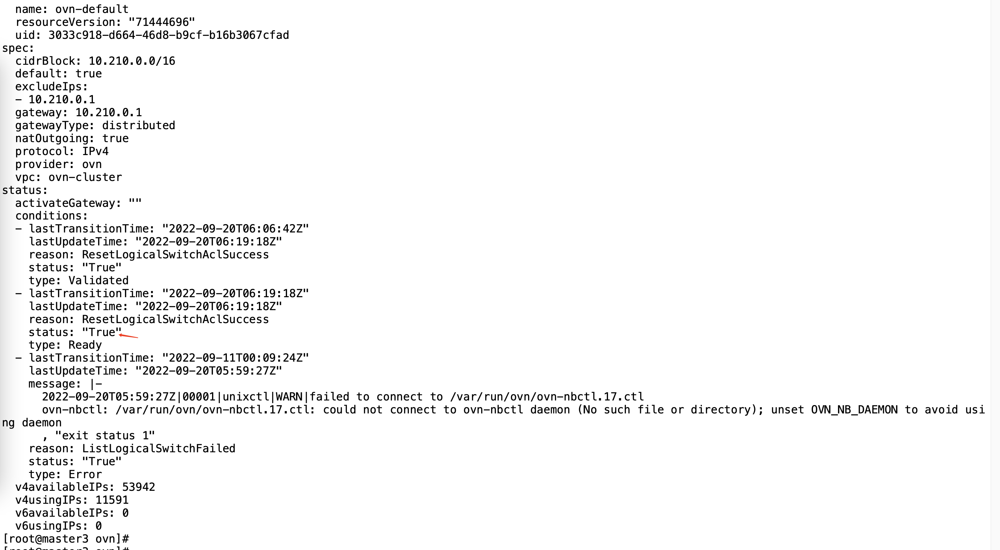
- Environment: Kubernetes 1.23.8 + kube-ovn v1.9.8
- kube-ovn-controller
- subnet资源状态字段
- kube-ovn IPAM模块
- ovn-central Pod
- k8s apiserver
- Component: Kubernetes
- Page ID: 124700099
- Original Title: 2022-09-20 Staging 环境，svc 访问不了问题
