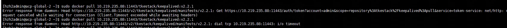
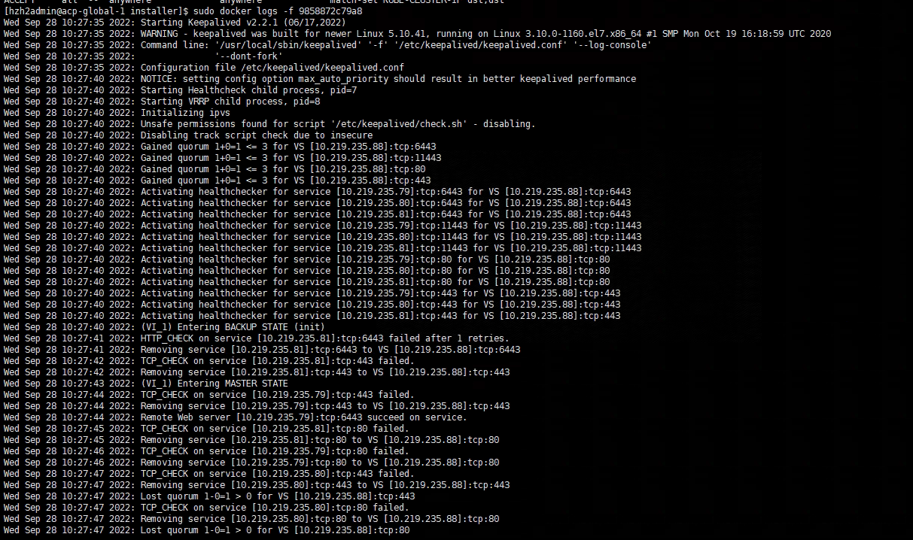
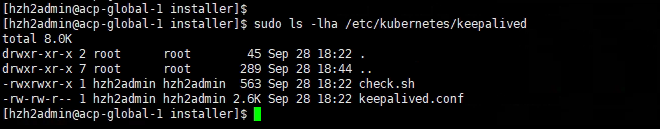

---
kind:
  - Troubleshooting
products:
  - Alauda Container Platform
  - Alauda DevOps
  - Alauda AI
  - Alauda Application Services
  - Alauda Service Mesh
  - Alauda Developer Portal
ProductsVersion:
  - 4.1.0,4.2.x
---
<!-- A type of document that involves encountering a fault, diagnosing it, performing root cause analysis, and providing solutions. -->

# 3.9

部署进度卡在ars同步 两个master节点无法下载keepalived镜像 check.sh脚本缺少权限

## Cause
- /etc/kubernetes/keepalived/check.sh脚本属主为hzh2admin导致权限不足

## Resolution
- 修改3个master节点/etc/kubernetes/keepalived目录属主属组为root
- 重启keepalived容器

## [workaround]

## [Related Information]
**Screenshots**
1、自建vip,排查发现其中2个mster节点无法下载keepalived镜像
2、在正常的master节点查看keepalived容器日志,发现check.sh脚本缺少权限
3、ls -lha /etc/kubernetes/keepalived查看check.sh脚本属主为hzh2admin
- Environment: 3.9版本，自建VIP使用keepalived
- keepalived容器
- check.sh
- /etc/kubernetes/keepalived
- Component: Kubernetes
- Page ID: 127409141
- Original Title: 3.9-基础架构-部署进度卡在ars同步
