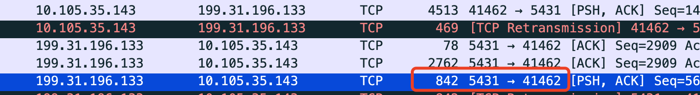
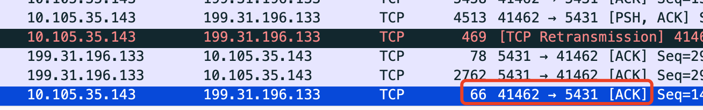
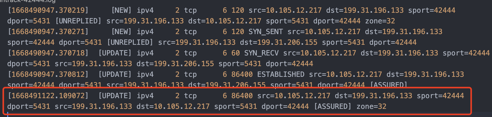

---
kind:
  - Troubleshooting
products:
  - Alauda Container Platform
  - Alauda DevOps
  - Alauda AI
  - Alauda Application Services
  - Alauda Service Mesh
  - Alauda Developer Portal
ProductsVersion:
  - 4.1.0,4.2.x
---
<!-- A type of document that involves encountering a fault, diagnosing it, performing root cause analysis, and providing solutions. -->

# 应用访问集群外数据库线程挂起

JAVA 应用通过子网 SNAT 访问集群外数据库出现线程挂起，设置 socket 超时参数后问题消失 堆栈跟踪显示在 socketRead0 处挂起

## Cause
- OVS 调用 conntrack 异常导致网络包被丢包
- 客户端未设置 TCP_USER_TIMEOUT 参数
- kube-ovn-controller 处理 Network Policy 更新时存在空窗期导致流量被丢弃

## Resolution
- 升级 Kube-OVN 版本并调整配置绕过 conntrack 处理
- 应用补丁 https://github.com/kubeovn/kube-ovn/pull/2677 修复 kube-ovn-controller 问题

## [workaround]
- 设置 TCP_USER_TIMEOUT 参数以主动关闭超时连接

## [Related Information]
**Screenshots**

- OVS conntrack
- NetworkPolicy
- Kube-OVN-controller
- TCP_USER_TIMEOUT
- net.ipv4.tcp_fin_timeout
- ZGWHJY-43
- kubeovn/kube-ovn#2677
- Component: Kubernetes
- Page ID: 127429757
- Original Title: 应用访问集群外数据库线程挂起
