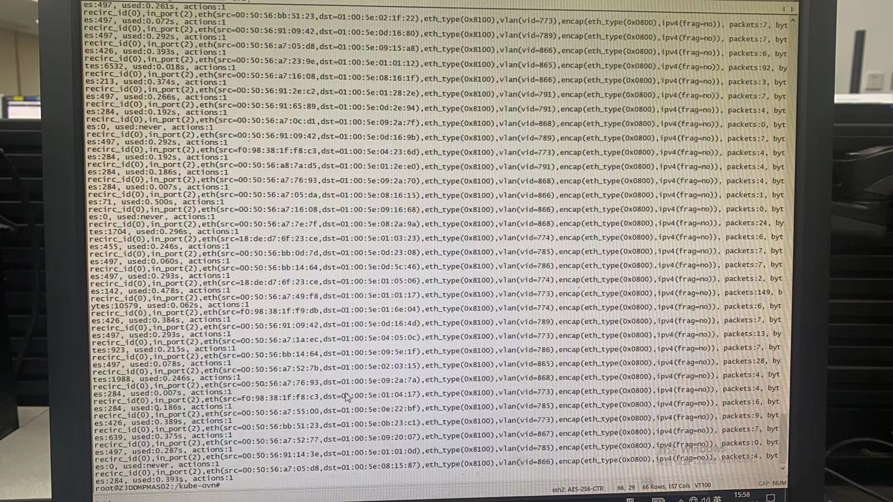
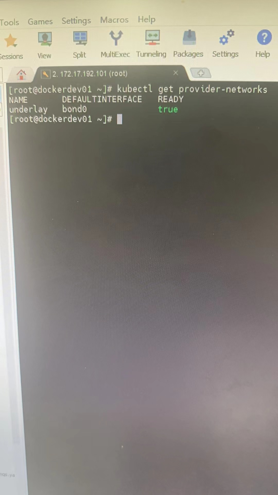
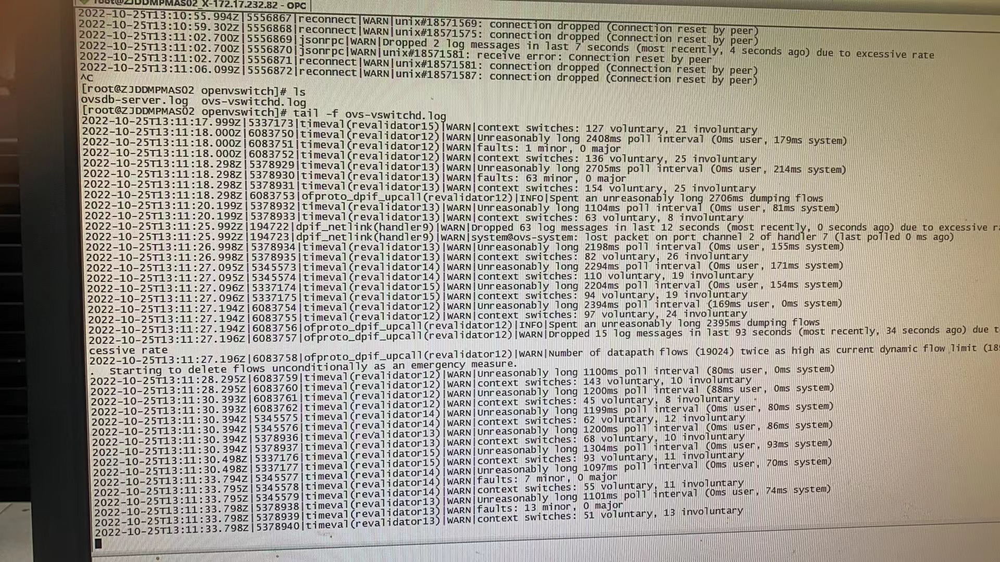

---
kind:
  - Troubleshooting
products:
  - Alauda Container Platform
  - Alauda DevOps
  - Alauda AI
  - Alauda Application Services
  - Alauda Service Mesh
  - Alauda Developer Portal
ProductsVersion:
  - 4.1.0,4.2.x
---
<!-- A type of document that involves encountering a fault, diagnosing it, performing root cause analysis, and providing solutions. -->

# ovs

pod 之间的时延不稳定 ovs-ovn CPU 使用率持续 100%

## Cause
- 底层交换机开启混杂模式导致大量 underlay 网络数据包进入 ovs 网桥
- 存在未使用的 provider-network 配置

## Resolution
- kubectl get provider-networks underlay -o yaml >/tmp/provider-networks.yaml
- kubectl delete provider-networks underlay

## [workaround]
- 删除所有 networkpolicy
- 提高 ovs-ovn 资源限额 (国产CPU环境无效)

## [Related Information]
**Screenshots**

- Environment: CNI 版本: 1.8.5 | 部署方式: overlay
- provider-network
- ovs网桥
- ovn-controller.log
- networkpolicy
- ovs-dpctl
- Component: Kubernetes
- Page ID: 127432454
- Original Title: ovs-ovn CPU 使用率 100%
