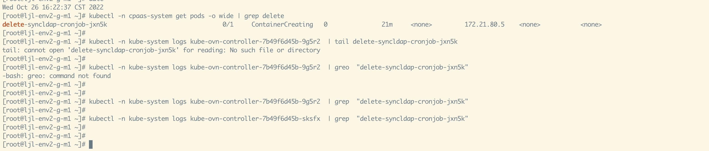

---
kind:
  - Troubleshooting
products:
  - Alauda Container Platform
  - Alauda DevOps
  - Alauda AI
  - Alauda Application Services
  - Alauda Service Mesh
  - Alauda Developer Portal
ProductsVersion:
  - 4.1.0,4.2.x
---
<!-- A type of document that involves encountering a fault, diagnosing it, performing root cause analysis, and providing solutions. -->

# 断电一个master节点后, kube

kube-ovn-controller 卡住，无法继续 handlePodAdd 流程(及其他流程)

## Cause
- kube-ovn-controller 和 central 的 leader 同时部署在同一 master node，该节点断电导致 leader 不可用

## Resolution

## [workaround]

## [Related Information]
**Screenshots**

- Environment: CNI 版本：ACP 3.10.2
- kube-ovn-controller
- kube-ovn-central leader election
- Component: Kubernetes
- Page ID: 127432751
- Original Title: 断电一个master节点后, kube-ovn-controller 卡住
