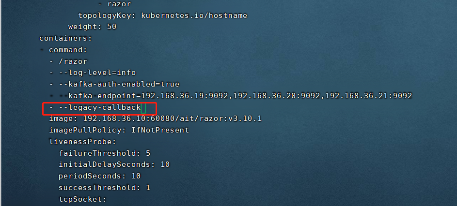

---
kind:
  - Troubleshooting
products:
  - Alauda Container Platform
  - Alauda DevOps
  - Alauda AI
  - Alauda Application Services
  - Alauda Service Mesh
  - Alauda Developer Portal
ProductsVersion:
  - 4.1.0,4.2.x
---
<!-- A type of document that involves encountering a fault, diagnosing it, performing root cause analysis, and providing solutions. -->

# 3.10

日志采集失败 es及kafka无数据写入且无报错

## Cause
- 业务集群缺少callback-secret和log-center-secret资源
- cluster-transformer未同步secret资源
- 3.10.0版本与k8s 1.24存在兼容性问题

## Resolution
- 升级平台版本到3.10.1

## [workaround]
- 给razor添加参数--legacy-callback：kubectl edit deploy -ncpaas-system razor

## [Related Information]
**Screenshots**

- Environment: 平台版本3.10.0，业务集群k8s版本1.24
- razor
- cluster-transformer
- callback-secret
- log-center-secret
- log-callback-secret
- --legacy-callback
- Component: Kubernetes
- Page ID: 130550569
- Original Title: 3.10-基础设施-业务集群日志存储下沉后日志采集失败-业务集群k8s版本为1.24
