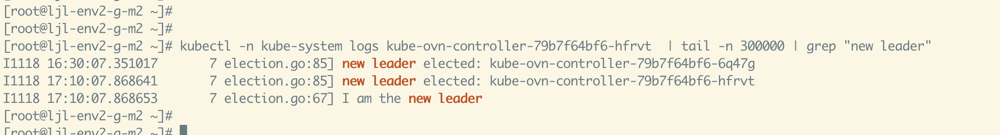
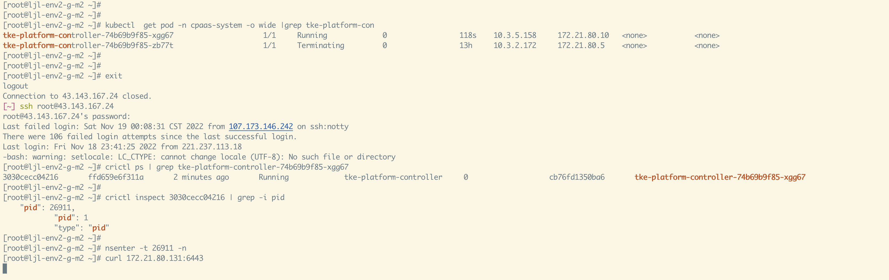
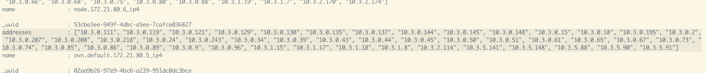
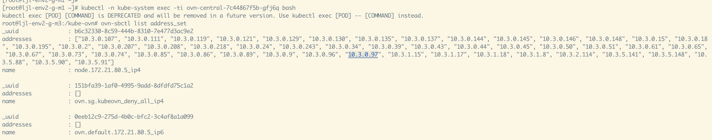
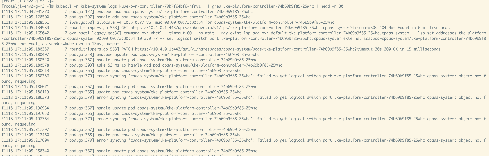
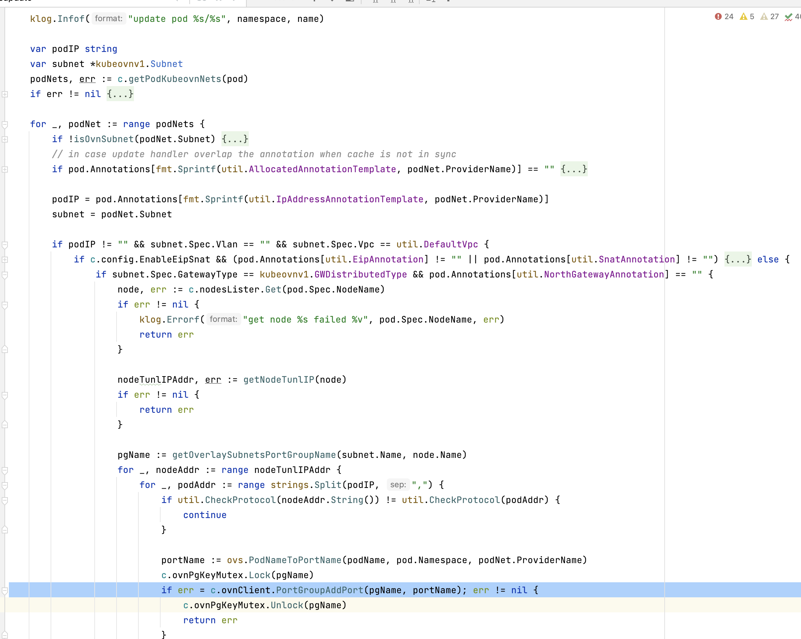

---
kind:
  - Troubleshooting
products:
  - Alauda Container Platform
  - Alauda DevOps
  - Alauda AI
  - Alauda Application Services
  - Alauda Service Mesh
  - Alauda Developer Portal
ProductsVersion:
  - 4.1.0,4.2.x
---
<!-- A type of document that involves encountering a fault, diagnosing it, performing root cause analysis, and providing solutions. -->

# nb leader 所在节点断电后的 libovsdb list lsp失效

系统缩容出现异常 新建 pod 虽然是 running 状态但无法访问外网 pod 的地址未被加入 ovn-default port group

## Cause
- handleUpdate 逻辑中错误返回导致流程中断
- 第三方库 libovsdb 的 list lsp 接口失效

## Resolution
- 通过日志记录更多信息进行 debug 处理

## [workaround]

## [Related Information]
**Screenshots**

- Environment: CNI 版本: 1.9.14
- libovsdb
- ovn-default port group
- controller leader
- nb leader pod
- handleUpdate 逻辑
- Component: Kubernetes
- Page ID: 130564267
- Original Title: nb leader 所在节点断电后的 libovsdb list lsp失效
