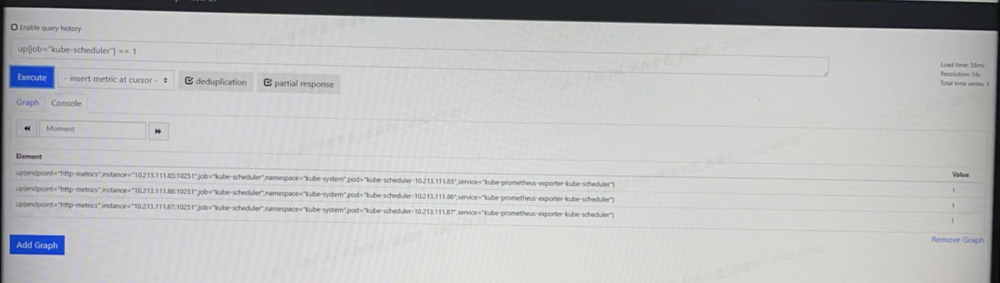

---
kind:
  - Troubleshooting
products:
  - Alauda Container Platform
  - Alauda DevOps
  - Alauda AI
  - Alauda Application Services
  - Alauda Service Mesh
  - Alauda Developer Portal
ProductsVersion:
  - 4.1.0,4.2.x
---
<!-- A type of document that involves encountering a fault, diagnosing it, performing root cause analysis, and providing solutions. -->

# scheduler监控异常

scheduler的检查指标一直告警 Prometheus查看up指标正常但持续告警

## Cause
- TKE3.8.0告警策略表达式存在语法错误：sum(up{job="kube-scheduler"==1}or on() vector(0) / count(up{job="kube-scheduler"}) < 1 缺少外层括号

## Resolution
- 升级到TKE3.8.1版本
- 手动修正告警策略表达式为：(sum(up{job="kube-scheduler"==1}or on() vector(0) / count(up{job="kube-scheduler"}) < 1)

## [workaround]

## [Related Information]
**Screenshots**

- Environment: TKE 3.8.0
- kube-scheduler
- up指标
- job="kube-scheduler"
- 告警策略表达式
- Component: Kubernetes
- Page ID: 130576896
- Original Title: scheduler监控异常
