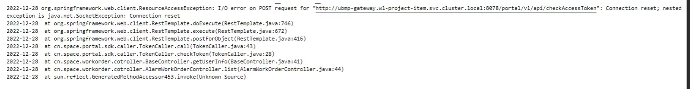

---
kind:
  - Troubleshooting
products:
  - Alauda Container Platform
  - Alauda DevOps
  - Alauda AI
  - Alauda Application Services
  - Alauda Service Mesh
  - Alauda Developer Portal
ProductsVersion:
  - 4.1.0,4.2.x
---
<!-- A type of document that involves encountering a fault, diagnosing it, performing root cause analysis, and providing solutions. -->

# 集群内部svc名称进行链接

偶现链接被重置

## Cause
- conntrack模块在严格模式下丢弃无效TCP包导致连接重置

## Resolution
- echo 1 > /proc/sys/net/ipv4/netfilter/ip_conntrack_tcp_be_liberal
- echo net.netfilter.nf_conntrack_tcp_loose = 1 > /etc/sysctl.conf && sysctl -p

## [workaround]

## [Related Information]
**Screenshots**

- Environment: 通用
- ip_conntrack_tcp_be_liberal
- nf_conntrack_tcp_loose
- kube-proxy
- netfilter
- Component: Kubernetes
- Page ID: 133090360
- Original Title: 集群内部svc名称进行链接-偶现链接被重置
