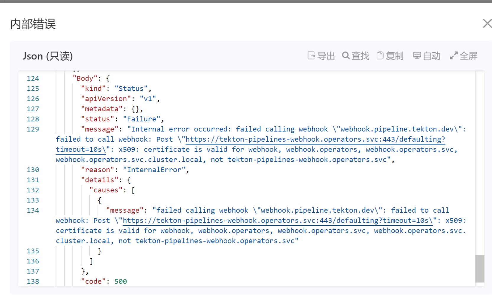

---
kind:
  - Troubleshooting
products:
  - Alauda Container Platform
  - Alauda DevOps
  - Alauda AI
  - Alauda Application Services
  - Alauda Service Mesh
  - Alauda Developer Portal
ProductsVersion:
  - 4.1.0,4.2.x
---
<!-- A type of document that involves encountering a fault, diagnosing it, performing root cause analysis, and providing solutions. -->

# 无法正常创建ClusterTask

无法创建ClusterTask资源，被webhook拦截，提示x509认证异常 tekton webhook日志显示TLS handshake error: tls: bad certificate tekton controller日志报错x509证书不匹配

## Cause
- tekton-pipelines-webhook证书的SAN(Subject Alternative Name)未包含tekton-pipelines-webhook.operators.svc
- 3.9版本遗留的validatingwebhookconfigurations资源与3.10版本存在resourceVersion冲突

## Resolution
- kubectl delete validatingwebhookconfigurations config.webhook.operator.tekton.dev
- kubectl delete validatingwebhookconfigurations validation.webhook.operator.tekton.dev
- kubectl delete mutatingwebhookconfigurations webhook.operator.tekton.dev

## [workaround]

## [Related Information]
**Screenshots**

, InvolvedObject:v1.ObjectReference{Kind:"TaskRun", Namespace:"product-demo-mesh", Name:"test-xu-dssh5-git-clone", UID:"989278b3-2887-41c2-9c76-ad143b61cabb", APIVersion:"tekton.dev/v1beta1", ResourceVersion:"1114985588", FieldPath:""}, Reason:"Error", Message:"Internal error occurred: failed calling webhook \"webhook.pipeline.tekton.dev\": failed to call webhook: Post \"<https://tekton-pipelines-webhook.operators.svc:443/defaulting?timeout=10s\>": x509: certificate is valid for webhook, webhook.operators, webhook.operators.svc, webhook.operators.svc.cluster.local, not tekton-pipelines-webhook.operators.svc", Source:v1.EventSource{Component:"TaskRun", Host:""}, FirstTimestamp:time.Date(2022, time.November, 1, 12, 47, 51, 485230533, time.Local), LastTimestamp:time.Date(2022, time.November, 1, 13, 43, 9, 449343628, time.Local), Count:21, Type:"Warning", EventTime:time.Date(1, time.January, 1, 0, 0, 0, 0, time.UTC), Series\*v1.EventSeries)(nil), Action:"", Related\*v1.ObjectReference)(nil), ReportingController:"", ReportingInstance:""}': 'events "test-xu-dssh5-git-clone.172376c40e71edc5" is forbidden: unable to create new content in namespace product-demo-mesh because it is being terminated' (will not retry!)

6、 查看tekton 资源实例的描述信息，得到如下问题：
- Environment: ACP 3.10.0 (从3.9.0升级)
- validatingwebhookconfigurations
- mutatingwebhookconfigurations
- tekton-pipelines-webhook.operators.svc
- webhook
- webhook.operators
- webhook.operators.svc
- webhook.operators.svc.cluster.local
- Component: Kubernetes
- Page ID: 133095365
- Original Title: 无法正常创建ClusterTask
