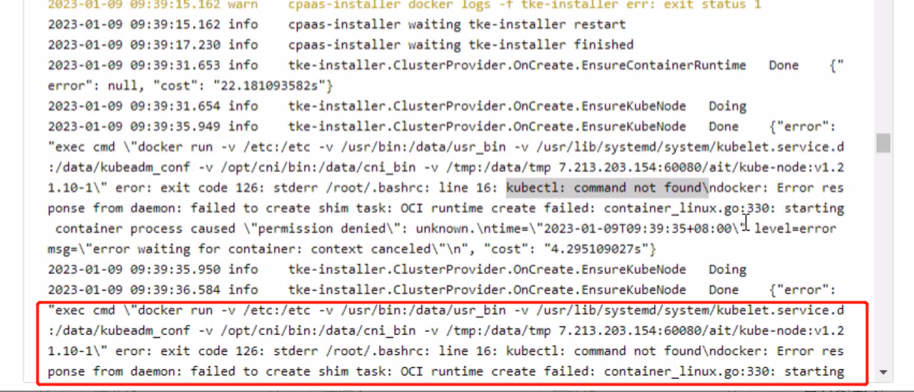
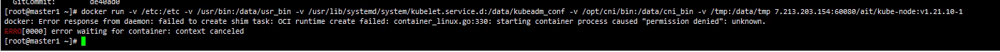

---
kind:
  - Troubleshooting
products:
  - Alauda Container Platform
  - Alauda DevOps
  - Alauda AI
  - Alauda Application Services
  - Alauda Service Mesh
  - Alauda Developer Portal
ProductsVersion:
  - 4.1.0,4.2.x
---
<!-- A type of document that involves encountering a fault, diagnosing it, performing root cause analysis, and providing solutions. -->

# 3.8.1

部署失败提示: Error response from daemon: failed to create shim task: OCI runtime create failed: container_linux.go:330: starting 手动执行 docker run 命令返回: permission denied find / -name runc 返回两个路径: /usr/local/bin/runc 和 /usr/bin/runc

## Cause
- 系统存在多个 runc 实例导致冲突: /usr/local/bin/runc(系统自带) 与 /usr/bin/runc 并存

## Resolution
- 删除三台 master 节点上的系统自带 runc: /usr/local/bin/runc

## [workaround]

## [Related Information]
**Screenshots**

- Environment: 华为-V3.8.2-isdp-1 版本 EulerOS 2.10 操作系统
- runc
- /usr/local/bin/runc
- /usr/bin/runc
- kubelet.service.d
- docker run -v 挂载路径
- Component: Kubernetes
- Page ID: 133102769
- Original Title: 3.8.1-平台部署卡在安装K8S(EulerOS)
