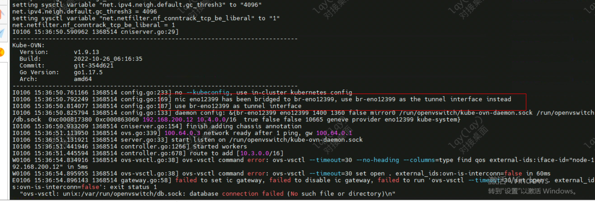
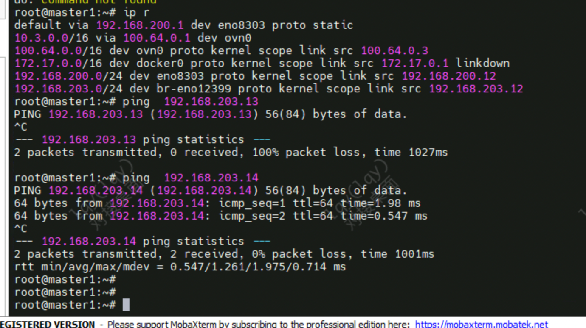

---
kind:
  - Troubleshooting
products:
  - Alauda Container Platform
  - Alauda DevOps
  - Alauda AI
  - Alauda Application Services
  - Alauda Service Mesh
  - Alauda Developer Portal
ProductsVersion:
  - 4.1.0,4.2.x
---
<!-- A type of document that involves encountering a fault, diagnosing it, performing root cause analysis, and providing solutions. -->

# 特微

节点200.13上的pod无法访问其他节点pod 12/14节点pod访问正常

## Cause
- underlay配置使用了eno12399网卡
- IaaS层对eno12399网卡存在跨节点通信限制

## Resolution
- 临时将overlay通信网卡改为管理网卡eno0800
- 待IaaS层修复eno12399网卡问题后恢复配置

## [workaround]

## [Related Information]
**Screenshots**

- Environment: ACP 3.10, kube-ovn v1.9.13
- kube-ovn
- eno12399
- eno0800
- overlay/underlay配置
- Component: Kubernetes
- Page ID: 136517129
- Original Title: 特微-跨节点pod 访问不通，确认为Iaas 配置问题
