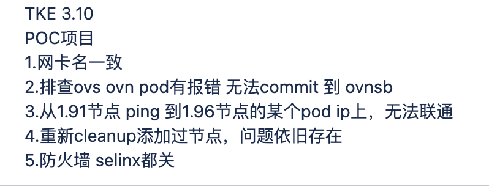
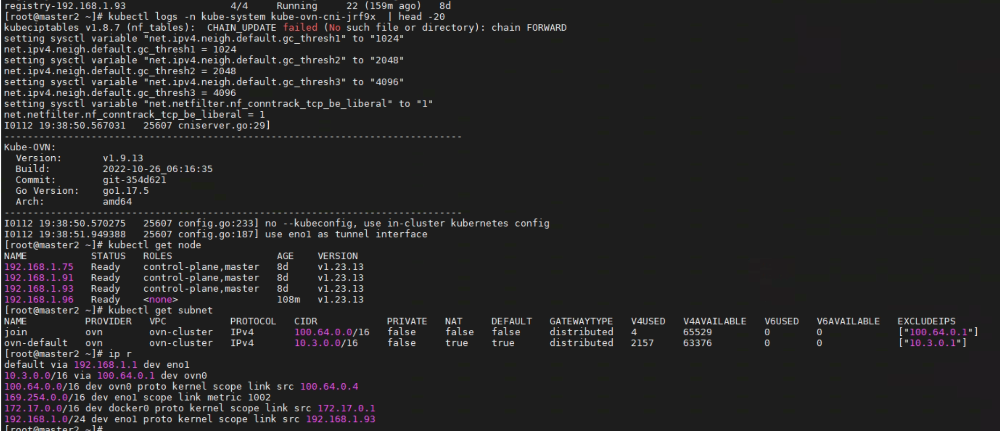
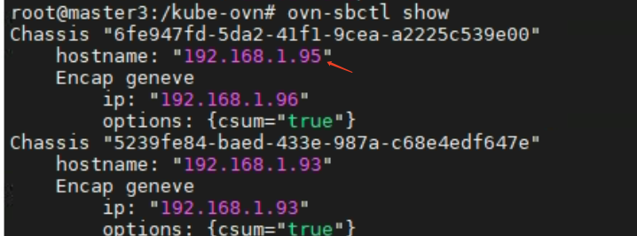

---
kind:
  - Troubleshooting
products:
  - Alauda Container Platform
  - Alauda DevOps
  - Alauda AI
  - Alauda Application Services
  - Alauda Service Mesh
  - Alauda Developer Portal
ProductsVersion:
  - 4.1.0,4.2.x
---
<!-- A type of document that involves encountering a fault, diagnosing it, performing root cause analysis, and providing solutions. -->

# 高寻真源

新加 worker 节点上的 pod 访问不通

## Cause
- 节点 IP 地址冲突（原 1.95 改为 1.96）导致 ovs-ovn 组件状态异常

## Resolution
- 删除 chassis 记录，重建 ovs-ovn 和 kube-ovn-cni pod

## [workaround]

## [Related Information]
**Screenshots**

- Environment: CNI 版本：ACP 3.10，kube-ovn v1.9.13
- ovs-ovn pod
- kube-ovn-cni pod
- chassis 记录
- IP 地址配置
- Component: Kubernetes
- Page ID: 136517154
- Original Title: 高寻真源-新加节点网络不通
