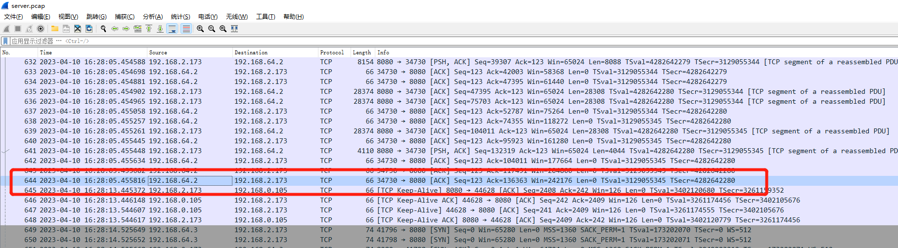
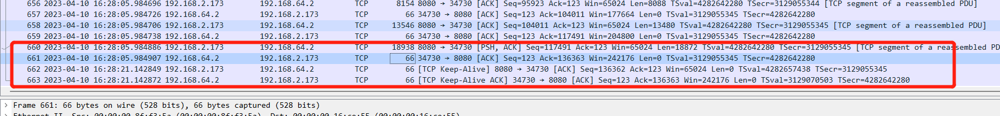
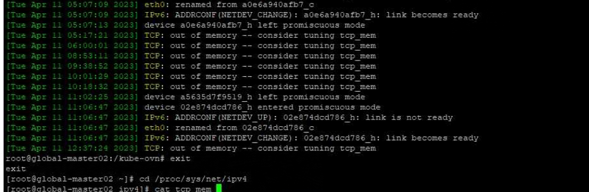
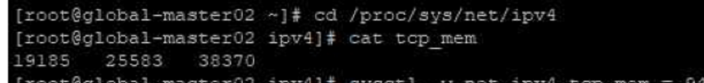
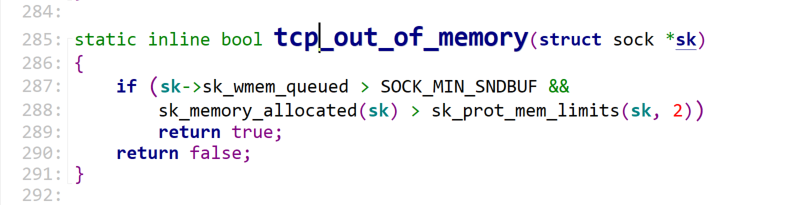

---
kind:
  - Troubleshooting
products:
  - Alauda Container Platform
  - Alauda DevOps
  - Alauda AI
  - Alauda Application Services
  - Alauda Service Mesh
  - Alauda Developer Portal
ProductsVersion:
  - 4.1.0,4.2.x
---
<!-- A type of document that involves encountering a fault, diagnosing it, performing root cause analysis, and providing solutions. -->

# wget 进度大概率到一半就hang住了

wget下载进度到一半停止 无TCP重传或丢包 内核报错TCP: out of memory

## Cause
- net.ipv4.tcp_mem配置过低导致内存耗尽

## Resolution
- sysctl -w net.ipv4.tcp_mem="196608 262144 393216"

## [workaround]

## [Related Information]
**Screenshots**

- Environment: x86_64, 内核4.19.90, Kubernetes ACP 3.8.3, CNI kube-ovn v1.8.14
- tcp_mem
- /proc/net/sockstat
- tcp_tw_recycle
- mtu
- checksum
- sysctl
- Component: Kubernetes
- Page ID: 144904388
- Original Title: wget 进度大概率到一半就hang住了
