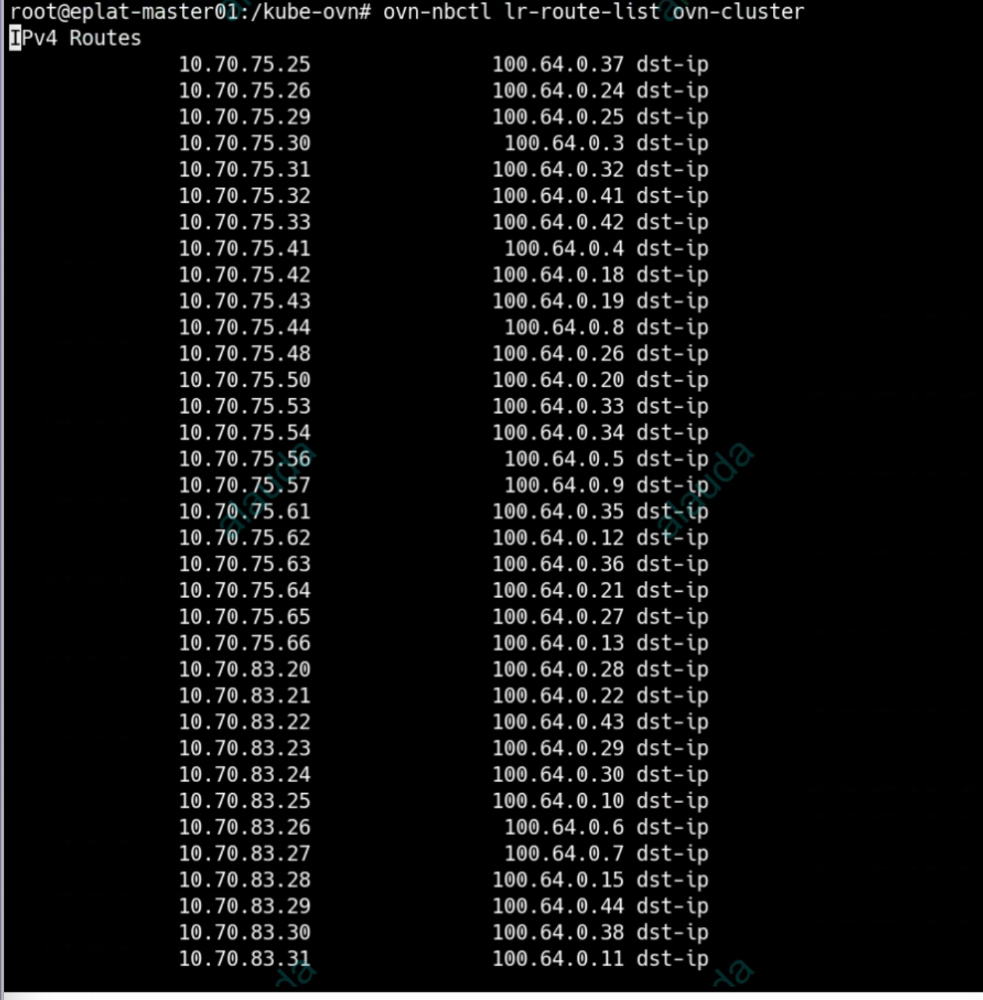

---
kind:
  - Troubleshooting
products:
  - Alauda Container Platform
  - Alauda DevOps
  - Alauda AI
  - Alauda Application Services
  - Alauda Service Mesh
  - Alauda Developer Portal
ProductsVersion:
  - 4.1.0,4.2.x
---
<!-- A type of document that involves encountering a fault, diagnosing it, performing root cause analysis, and providing solutions. -->

# 宝信集中式子网问题

容器网络的Pod无法访问集群外的SVC地址 telnet测试不通

## Cause
- 网关节点切换时旧路由被删除且新路由未正确更新
- 节点状态恢复触发路由删除但subnet状态未同步

## Resolution
- 修改subnet.Spec.GatewayNode字段临时移除当前active网关节点并更新
- 网络恢复后重新添加被移除的网关节点

## [workaround]
- 通过kubectl edit subnet或页面修改subnet配置切换网关节点

## [Related Information]
**Screenshots**

- Environment: Kubernetes集群使用Kube-OVN v1.8.14 CNI，50节点，集中式子网(ovn-default)主备模式
- subnet
- static-route
- activeGateway
- gatewayNode
- deleteEcmpRouteForNode
- reconcileSubnet
- Component: Kubernetes
- Page ID: 146344755
- Original Title: 宝信集中式子网问题
