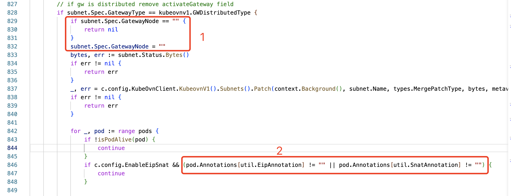
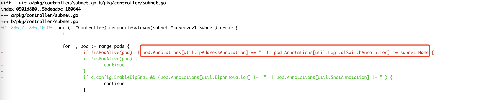

---
kind:
  - Troubleshooting
products:
  - Alauda Container Platform
  - Alauda DevOps
  - Alauda AI
  - Alauda Application Services
  - Alauda Service Mesh
  - Alauda Developer Portal
ProductsVersion:
  - 4.1.0,4.2.x
---
<!-- A type of document that involves encountering a fault, diagnosing it, performing root cause analysis, and providing solutions. -->

# 宝信集中式子网切换问题

ovn-default子网下的部分pod出现访问不了外部网络的情况

## Cause
- 集中式子网切换分布式子网后activeGateway字段未清空(1.8.16之前版本)
- 子网切换时过滤pod的subnet匹配条件被错误删除

## Resolution
- 修改ovn-default子网gatewayNode并删除activeGateway，等待网关节点更新

## [workaround]

## [Related Information]
**Screenshots**

- Environment: Kubernetes, CNI: Kube-OVN v1.8.16, ACP 3.6.2
- activeGateway
- gatewayNode
- subnet配置
- Kube-OVN 1.8.16
- Component: Kubernetes
- Page ID: 149593125
- Original Title: 宝信集中式子网切换问题
