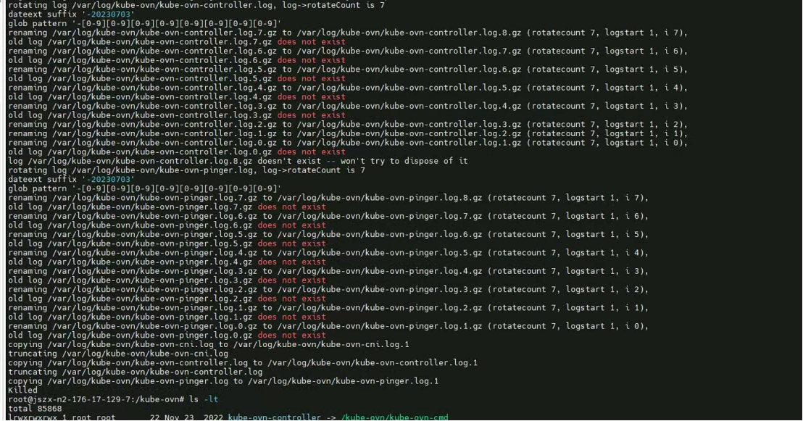
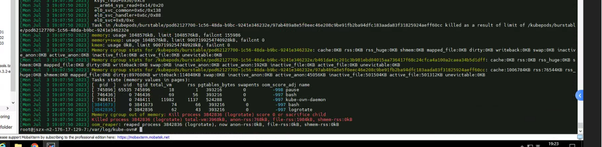

---
kind:
  - Troubleshooting
products:
  - Alauda Container Platform
  - Alauda DevOps
  - Alauda AI
  - Alauda Application Services
  - Alauda Service Mesh
  - Alauda Developer Portal
ProductsVersion:
  - 4.1.0,4.2.x
---
<!-- A type of document that involves encountering a fault, diagnosing it, performing root cause analysis, and providing solutions. -->

# kube

kube-ovn-pinger备份log一天增长20G logrotate执行时出现killed状态 dmesg显示触发OOM

## Cause
- kube-ovn-cni默认内存限制1G不足
- logrotate处理1.5G日志文件时触发cgroup OOM

## Resolution
- 将kube-ovn-pinger.log备份到其他目录
- 重启kube-ovn-pinger DaemonSet

## [workaround]

## [Related Information]
**Screenshots**

- Environment: Kubernetes集群(50节点) + Kube-OVN v1.8.14
- /etc/logrotate.d/ovn
- /var/log/kube-ovn/kube-ovn-pinger.log
- kube-ovn-cni
- memory limit配置
- Component: Kubernetes
- Page ID: 152641332
- Original Title: kube-ovn-pinger 备份log一天增加20G大小
